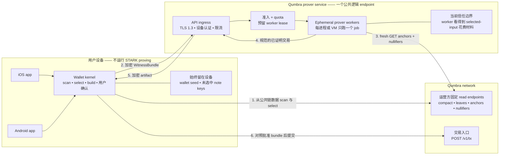

# 后端辅助证明 —— 可行性与安全交接

**状态:技术上可行,尚未构建。信任模型与生产安全门槛尚未决定。不得把当前
paired-prover binary 直接暴露到公网。**
英文权威版:[`backend-assisted-proving-security.md`](backend-assisted-proving-security.md)。

写于 2026-08-23,接续手机自证明重新讨论。本文记录一条产品裁决和一条技术结论:

- **Larry 已决定:**要求用户自己运行常驻 prover 太麻烦,不在考虑范围内。产品不得
  建立在用户自己的 Mac、家用服务器或租用 VM 上。
- **已查证:**Qumbra 可以在不改 `CONSENSUS_CFG` 的前提下,为所有钱包运营一个公共
  逻辑 prover service。但按现行交易协议,必须如实称为**受信任辅助证明**。

"一个 service"不等于一个进程或一台机器。产品可以只有一个 endpoint,后面由准入
队列随需求增长,把任务派给多个隔离 worker。

---

## 1. 一句话答案

可以:保留 b16,手机本地选币并让用户确认,把 `WitnessBundle` 通过认证加密通道交给
Qumbra 运营的 worker,由它返回已经证明的交易,最后仍由手机提交。

这样所有支持的手机都有 send 路径,保留今天 148,625 字节的共识 wire 大小,也不需要
T2 重新 mint 或永久双验证器。代价不在共识 wire 上,而在下文的服务信任、隐私、
可用性与运营账单上。

## 2. 已经存在的部分

当前拆分已经是正确的**功能接缝**:

1. 钱包扫描、扣除已花 notes、选 inputs、构造 Merkle witnesses、固定两个 outputs,
   然后产出带版本的 `WitnessBundle`。
2. Prover host 解码并重新验证 bundle,获取新鲜的公共 anchors/nullifiers,运行证明,
   返回规范交易字节。
3. iOS 钱包核对返回长度与 SHA3-256,再自己提交完全相同的字节。

本次交接查阅的版本与接缝:

| 仓库 | revision | 接缝 |
|---|---:|---|
| `qumbra-lab` | `1c5a27b` | `crates/qumbra-wallet/src/bundle.rs`、`spend.rs`; `crates/qumbra-ffi/src/pairing.rs` |
| `qumbra-wallet-macos` | `4bdde1d` | `rust/src/bin/qumbra-paired-prover.rs` |
| `qumbra-wallet-ios` | `e3a9e2d` | `PairedProverPipe.swift`、`SendFlow.swift` |

Mac 通道已经有全新 256-bit pairing secret、ChaCha20-Poly1305 framing、分方向 nonce、
严格 counter、bundle 校验、preflight、进度事件、artifact 分块和端到端 digest。这些部件
都能复用。但它的一次性 LAN 威胁模型不是公网服务安全设计。

## 3. 最关键的信任事实

`WitnessBundle` 不是不透明的证明提示。它会序列化每个 selected input 的 `sk`、value、
`rho`、`rseed`、diversifier 与 Merkle path
(`crates/qumbra-wallet/src/bundle.rs:33-40,385-401`)。模块顶层注释把它称为
"spend authority for exactly one transaction",并限定只能穿过用户本地可信边界。

这句话描述的是诚实实现预期的交接,不是对被修改 prover host 的密码学限制。Qumbra
现行交易模型把 spend-key knowledge 放在 STARK 内,没有另一份留在手机上的逐笔授权
签名。所以恶意 host 可以:

1. 读取 selected notes 的 openings 和 membership witnesses;
2. 无视收到 bundle 里用户批准的 output 字段;
3. 另造一组支付给自己的 outputs;
4. 自己证明并直接提交那笔冲突交易。

手机核对 host 返回的交易也堵不住这一攻击:host 可以给手机返回诚实 artifact,同时独立
提交冲突交易。最后是哪一笔落链,取决于 nullifier race。

爆炸半径有限,但足够严重:

- 服务**拿不到**钱包 seed,也拿不到本次 bundle 以外 notes 的 keys;
- 它能花掉 selected real inputs 的全部价值,包括本应作为找零返回的部分;
- 它能在同一点看到收款人/output 明文、amount、change、selected inputs、nullifiers、
  anchor、账户或设备身份以及来源 IP。

因此,Qumbra 运营的服务在技术上会暂时持有足以授权 selected-note spend 的材料。它在
法律上叫什么不属于本文范围;但从技术上,现行协议下不得宣传为 trustless 或
non-custodial。

## 4. 建议的公共服务边界

**对,prover service 必须连接 Qumbra nodes。** 当前 preflight 会获取 node 现行合法
anchor 集合,以及直到当前 anchor tip 的 nullifier 历史。只要 bundle anchor 已不再被
接受、nullifier 覆盖不完整,或 selected input 已花,它就在分配 STARK 工作之前拒绝
(`crates/qumbra-wallet/src/spend.rs:358-405`)。Prover 不需要钱包 scan state、wallet
directory 或提交 credential。

Worker 访问 node 只做只读 preflight。`POST /v1/tx` 仍由手机负责。Worker 的 read
endpoints 与钱包预期的 network identity 都由运营方/app 固定;请求里绝不能携带任意
node URL。

Admission service 不应把明文 witness bundle 放进持久队列。优先采用两阶段协议:钱包先
拿到一个有边界的 worker lease,确认容量已预留后才上传加密 bundle。如果不得不用持久
队列,队列里只能放加密给 worker 层的 envelope,短期过期,edge 与日志层都没有解密 key。

每个 worker 在独立的非特权进程或 VM 内只服务一个 job,然后退出。常驻 coordinator
可以调度工作;真正接触 witness 的进程不得跨用户复用。

提交方仍是手机。这无法消除 §3 的根本信任事实,但能减少意外提交权限,让批准内容可以
核对,并继续沿用钱包现有的 incomplete/duplicate 类型化恢复流程。

## 5. 任何公网 pilot 之前的 P0 门槛

| 风险 | 当前接缝事实 | 必须过的门槛 |
|---|---|---|
| Selected-input 被盗 | worker 收到 input `sk` 与 witness | 明确接受并披露 trusted-assisted 模型;否则上线前必须采用 §8 的更强授权 |
| SSRF / 访问内网 | 客户端提供 `scan_url` 与 `node_url`;`required_url` 只检查 `http://` 或 `https://` 前缀(`qumbra-paired-prover.rs:286-289,411-415`) | 从公共请求删除 URL。只接收 network identifier,由服务映射到运营方固定 endpoints。禁止 worker 访问 loopback、私网、cloud metadata 及其他任何出站目标 |
| 计算耗尽 | 一个 b16 proof 是约 12–15 GB 级任务;目标部署机尚未实测 | 准入之前先认证;限制队列深度、每设备 jobs、全局并发、证明最长时间与重试。支持协作取消,或在 lease 到期时杀 worker |
| 认证前内存耗尽 | 服务端接受攻击者声明的最大 128 MiB 加密帧,并在 AEAD 认证前分配(`qumbra-paired-prover.rs:180-213`) | 按实际格式测量后设置接近真实 bundle 的上限;先认证一个很小的固定首帧,再分配 payload |
| 手机内存耗尽 | 手机接受服务端声明的 `byte_length/chunk_count`,然后直接分配 `vec![None; chunks]`(`crates/qumbra-ffi/src/pairing.rs:585-599`) | 限制 artifact 总字节、chunk 数、每 chunk 字节、事件数与总响应字节;chunk 数必须从声明长度推导 |
| 慢连接占坑 | 当前 listener 同步逐个处理连接,handshake I/O 预算 30 秒(`qumbra-paired-prover.rs:84-99`) | 前面加有界并发认证 ingress;限制 header/read deadline、每来源连接数和全部未认证内存 |
| Witness 落盘 | 普通 heap 副本可能进入 swap、core dump、崩溃报告、trace 或被复用 allocator | payload 不进日志/trace;禁 core dump;secret 不进 metrics/error;worker 避免 swap;可明确清除的 buffer 做 zeroize;每个 job 后退出销毁 worker |
| 可复用 bearer secret | 当前对称 key 来自 QR secret 与公开 server nonce;只有每进程换全新 secret 才适用 | daemon 不得复用现有 QR 协议。注册每安装实例的非对称设备 key,认证服务身份,每次 ephemeral key exchange 提供 forward secrecy,支持设备轮换/撤销,每个 job 绑定唯一 challenge |
| 错网络/config | 当前请求只写 URL,没有固定 genesis 与 consensus config | protocol version、network ID、genesis hash、consensus-config label 必须同时绑定到 request、preflight、artifact 与 audit event;证明前任何不一致都拒绝 |
| 结果被替换或畸形 | 手机目前只证明 bytes 符合同一个 server 自己声明的 digest | 提交前解码 `TxEntry`,把 anchor、nullifiers、commitments、fee、discovery、rider 与已批准 bundle 逐项比较。这能抓 bug/替换,但挡不住 §3 的 host 直接提交攻击 |
| Worker 被攻破并横向移动 | 公共 worker 在短暂持有 spend authority 时解析攻击者数据 | 非特权运行、只读镜像、无 shell、无 cloud credential、禁止 metadata、最小文件系统、严格 syscall/network policy、每进程/VM 只放一个 tenant;部署 artifact 签名并 pin |

这些是上线门槛,不是以后再补的 hardening 清单。当前 binary 完成的是它原本设计的安全
性质 —— 一台可信手机在可信 LAN 上发一次请求 —— 不能把它当作已经通过了公网这道完全
不同的门槛。

## 6. 认证、滥用控制和隐私互相牵制

一个匿名 endpoint 每次请求分配 12–15 GB,就是开放的算力放大器。传统用户账户能解决
quota 归属,但会创造持久的钱包—身份关联。只按 IP 限制既容易绕过,也会误伤 carrier
NAT 后面的用户。

合理起点是钱包生成每安装实例的非对称设备 key,服务给它发 quota credential。它认证
的是一台设备,不是法律身份。但设计仍欠一项 Sybil/成本决定:app attestation、邀请/quota
token、匿名限流凭据、付费,或若干组合。没有免费选项,实现前必须写清隐私性质。

不管选哪种,协议最低要求都是:

- 唯一且会过期的 job ID,绑定认证请求与 bundle digest;
- 无需保留明文 bundle 的幂等状态/结果查询;
- 一个已接受 lease 不能同时启动两个 prove;
- 响应丢失时有边界的 retry 语义;
- 普通日志不得包含 recipient、amount、nullifier、bundle digest、IP 或 device key;
- abuse metadata 与 proving payload 分权访问并短期保留。

## 7. 容量与可用性

一个公共逻辑 endpoint 可以服务所有人,一个 prover 进程不可以。Pilot 可以故意从一个
排队 worker 起步;生产容量靠横向 worker,每个 worker 只为一个 proof 预留内存。

定容量之前,必须在真实部署 CPU/内存配置上测当前电路:

- peak RSS 与 peak committed memory;
- cold/warm prove time;
- 每 host 一个 worker 与安全并发时的耗时/内存方差;
- kill job 后取消延迟与内存归还;
- bundle 与 artifact 字节分布;
- 每个成功 proof 和每个被拒绝/放弃 job 的成本。

集中证明也会成为审查与可用性依赖。它需要公开的降级方式、UI 里有边界的排队估计、
在成为唯一 send 路径之前覆盖多个故障域,并明确区域性或全局故障时钱包怎么办。
"稍后再试"是诚实答案;无限 spinner 不是。

## 8. 更强信任模型的路线

| 路线 | 是否改共识 | 买到什么 | 剩余代价/风险 |
|---|---|---|---|
| 受信任 Qumbra 服务 | 不改 | 最快;保留 b16 与当前 wire 大小 | Qumbra/worker 能盗取 selected inputs;隐私、审查、入侵风险仍在 |
| 有 attestation 的 confidential VM | 原则上不改 | 减少普通运营人员/cloud 接触明文 witness | 信任转移到硬件、firmware、attestation、measured image 与 side-channel posture;prover 内存能否适配及性能均未测 |
| 手机持有的交易意图授权 | 要改 | worker 即使知道 proving witness,也不能授权不同 outputs | 需要另一把永不进入 bundle 的 secret、note/commitment 与 verifier 对它的绑定、规范 intent bytes、PQ 授权选择、迁移规则和新 size/performance 测量 |
| MPC / 加密外包证明 | 很可能大改 | 试图在密码学上不让任何单个 worker 看见 witness | 研究项目,性能与复杂度风险很大;现有证据下不是 launch 路径 |

授权路线至少要绑定 network/genesis、selected-note identity 或 nullifiers、anchor/新鲜度
规则、两个 output commitments、discovery bytes、rider、fee 与 expiry/replay domain。只在
API 层签名不够:节点或 proved statement 必须拒绝没有手机专属授权的冲突交易。

今天的 note format 没有这把授权 key。加它是协议项目,不是 backend refactor。

## 9. 与 b4 决策的关系

Backend-assisted proving 是手机决策里原先缺失的分支:

| 选择 | 所有支持手机都能 send | 共识 wire | T2 后果 | 永久依赖 |
|---|---|---:|---|---|
| b4 本地证明 + fallback | 低内存设备只有靠 fallback 才能 | 旧 mint 前数据约 236 KB;当前值欠测 | 重新 mint 或永久双验证器 | fallback prover 仍然存在 |
| b16 + Qumbra backend | 可以 | 今天 148,625 字节 | 无 | 受信任且可用的 prover service |
| 当前每笔 Mac 配对 | 只有用户每笔都操作 Mac 才能 | 今天 148,625 字节 | 无 | 产品 UX 已拒绝 |

因此,公共 backend 去掉了"为了让每台手机都能 send 而改 `CONSENSUS_CFG`"的理由。它
没有回答 Larry 是否接受 mainnet 上的 trusted-assisted 模型,也没有回答 §8 的更强授权
是否必须先落地。

如果选 backend 方向,b4/b8 手机测量不再是服务上线的前置条件。只有把本地自证明继续
保留为另一个未来产品目标时,那些测量才仍有用。

## 10. 仍欠的决定与证据

实现之前:

1. 决定上线范围:T2-only 实验、mainnet 可选路径,还是手机默认/唯一 send 路径。
2. 决定最低信任门槛:披露后的 trusted service、attested worker,还是手机持有的协议授权。
3. 决定 device credential 与滥用控制模型,不能悄悄造出一个钱包身份系统。
4. 定 retention、logging、incident response、queue/SLO 与 outage policy。
5. listener 暴露之前,分别对最终协议和部署做 threat model。

容量或成本声明之前要收的证据:

1. 目标 worker host 上当前 b16 的 peak memory 与 prove-time 分布。
2. 真实 bundle/artifact 上限,用来替换两边的 128 MiB protocol ceiling。
3. 一次 red-team drill,覆盖 SSRF、slowloris、未认证分配、认证 job flood、恶意 result
   size、disconnect/cancel、core dump、日志泄漏与 worker escape。
4. 一次端到端 drill,证明只要返回 artifact 的公共交易面与批准 bundle 任一项不同,
   手机就拒绝。

## 11. 本次交接的范围

- 用户自己运营常驻 prover 已按产品裁决**排除**。
- 产生本文时没有构建 backend service、daemon、cloud resource、账户系统或协议改动。
- `CONSENSUS_CFG` 未被触碰。
- 当前 paired-prover 仍然只是可信 LAN 上的一次请求工具。
