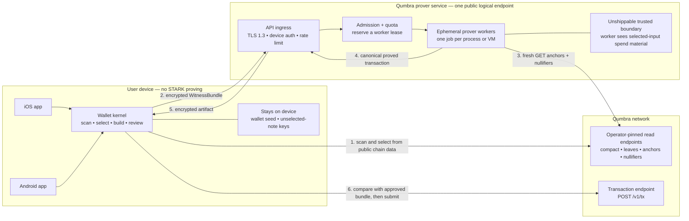

# Backend-assisted proving — feasibility and security handoff

**Status: RESEARCH RECORD, NOT A BUILD PLAN. Shared proving is computationally
feasible, but its current trusted form is not shippable for real-value use. Do
not expose the current paired-prover binary to the Internet.**
Paired with
[`backend-assisted-proving-security-zh.md`](backend-assisted-proving-security-zh.md).

Written 2026-08-23 after reopening phone self-proving. This document records one
product ruling and one technical finding:

- **DECIDED by Larry:** requiring users to operate a self-hosted persistent
  prover is too much friction and is out of scope. Do not build the product
  around a user's Mac, home server, or rented VM.
- **VERIFIED:** Qumbra can operate one public logical prover service for all
  wallets without changing `CONSENSUS_CFG`, but the unchanged protocol gives
  that service power to steal the selected inputs. That is a useful feasibility
  baseline, not an acceptable product architecture.

"One service" does not mean one process or one machine. The product surface can
be one endpoint while an admission queue dispatches jobs to multiple isolated
workers as demand grows.

---

## 1. Answer in one sentence

The compute topology works: keep b16, let the phone select and approve a spend,
send its `WitnessBundle` to a Qumbra-operated worker, return the proof, and let
the phone submit it. **That exact trusted topology must not ship with real
value.** A public product additionally needs either phone-held authorization
that the worker cannot forge or an attested confidential worker the operator
cannot read.

The unchanged trusted baseline gives every supported phone a send path, keeps
today's 148,625-byte consensus wire size, and avoids a T2 re-mint. It does so by
paying with selected-input spend authority, which is disqualifying rather than
a property to disclose away. The authorization design in §8 removes that power
but is itself a T2 re-mint-class protocol change whose wire/prover cost is owed.

## 2. What already exists

The current split is already the correct *functional* seam:

1. The wallet scans, subtracts spent notes, selects inputs, constructs Merkle
   witnesses, fixes both outputs, and emits a versioned `WitnessBundle`.
2. A prover host decodes and revalidates that bundle, fetches fresh public
   anchors and nullifiers, proves, and returns canonical transaction bytes.
3. The iOS wallet checks the returned byte length and SHA3-256, then submits the
   exact bytes itself.

Relevant code at the revisions inspected for this handoff:

| repository | revision | seam |
|---|---:|---|
| `qumbra-lab` | `1c5a27b` | `crates/qumbra-wallet/src/bundle.rs`, `spend.rs`; `crates/qumbra-ffi/src/pairing.rs` |
| `qumbra-wallet-macos` | `4bdde1d` | `rust/src/bin/qumbra-paired-prover.rs` |
| `qumbra-wallet-ios` | `e3a9e2d` | `PairedProverPipe.swift`, `SendFlow.swift` |

The Mac channel already has a fresh 256-bit pairing secret,
ChaCha20-Poly1305 framing, direction-separated nonces, exact counters, bundle
validation, preflight, progress events, chunked artifacts, and an end-to-end
digest. Those are useful components. Its one-shot LAN threat model is not a
public-service security design.

## 3. The load-bearing trust fact

`WitnessBundle` is not an opaque proving hint. It serializes each selected
input's `sk`, value, `rho`, `rseed`, diversifier, and Merkle path
(`crates/qumbra-wallet/src/bundle.rs:33-40,385-401`). The root module comment
calls the artifact "spend authority for exactly one transaction" and restricts
it to the user's local trusted boundary.

That wording describes the intended honest handoff, not a cryptographic
restriction on a modified prover host. Qumbra's current transaction model has
spend-key knowledge inside the STARK and no separate per-spend authorization
signature held back by the phone. A malicious host can therefore:

1. read the selected notes' openings and membership witnesses;
2. ignore the approved output fields in the received bundle;
3. construct different outputs paying itself;
4. prove and submit that conflicting spend directly.

Checking the transaction returned to the phone does not close this attack: the
host can return an honest artifact while independently submitting the conflicting
one. The nullifier race decides which lands.

The blast radius is bounded but material:

- the service does **not** receive the wallet seed or keys for notes absent from
  this bundle;
- it can spend the full value of the selected real inputs, including value that
  was supposed to return as change;
- it sees the recipient/output plaintexts, amount, change, selected inputs,
  nullifiers, anchor, account or device identity, and source IP in one place.

Therefore a Qumbra-operated service is technically a temporary holder of enough
material to authorize the selected-note spend. Whether that has a legal label is
outside this document; technically it must not be marketed as trustless or
non-custodial under the current protocol, and this document does not recommend
shipping it for real-value use.

## 4. Baseline service topology and node connectivity

This diagram answers how the apps, prover tier, and Qumbra nodes connect. It is
not by itself a shippable security design: §8 must replace the highlighted
trusted-worker boundary with phone-held authorization or an attested
confidential worker.



**Yes, the prover service must connect to Qumbra nodes.** The current preflight
fetches the node's current valid-anchor set and the nullifier history through the
current anchor tip. It refuses before allocating STARK work if the bundle's
anchor is no longer accepted, nullifier coverage is incomplete, or a selected
input is already spent (`crates/qumbra-wallet/src/spend.rs:358-405`). The prover
does not need wallet scan state, a wallet directory, or a submission credential.

The worker's node access is read-only preflight. The phone remains responsible
for `POST /v1/tx`. Both the worker's read endpoints and the wallet's expected
network identity are operator/app pinned; a request must never carry an
arbitrary node URL.

The admission service should not place plaintext witness bundles in a durable
queue. Prefer a two-stage protocol: the wallet first obtains a bounded worker
lease, then uploads the encrypted bundle only after capacity is reserved. If a
durable queue is unavoidable, it holds only an envelope encrypted to the worker
tier, with a short expiry and no edge/logging key able to decrypt it.

Each worker serves one job in a separate unprivileged process or VM and exits.
A long-lived coordinator may schedule work; the process that held a witness
must not be reused across users.

### Phone submission is engineering hygiene, not a trust argument

The phone remains the submitter so the service holds no submission credential
and incomplete/duplicate recovery stays in the wallet's existing typed flow.
This is worthwhile engineering hygiene. It is not a selected-input theft
control: a malicious worker can connect to the same public node and submit its
conflicting proof itself. The architecture diagram shows the honest data flow,
not a security boundary that prevents §3.

## 5. P0 gates before any Internet pilot

| risk | fact in the current seam | required gate |
|---|---|---|
| Selected-input theft | the worker receives the input `sk` and witness | Do not ship this form for real value. Require §8's phone-held authorization or an attested worker whose measurement/key the wallet verifies before upload |
| SSRF / internal-network reachability | the client supplies `scan_url` and `node_url`; `required_url` checks only an `http://` or `https://` prefix (`qumbra-paired-prover.rs:286-289,411-415`) | Remove URLs from the public request. Accept a network identifier and map it to operator-pinned endpoints. Deny worker access to loopback, private ranges, cloud metadata, and all other egress |
| Compute exhaustion | one b16 proof is roughly a 12–15 GB-class job; the real deployment target is unmeasured | Authenticate before admission; bound queue depth, jobs per device, global concurrency, proof wall time, and retries. Add cooperative cancellation or kill the worker on lease expiry |
| Pre-auth memory exhaustion | the server accepts an attacker-declared encrypted frame up to 128 MiB and allocates it before AEAD authentication (`qumbra-paired-prover.rs:180-213`) | Set a measured bundle ceiling near the real format size; authenticate a small fixed first message before allocating the payload |
| Client memory exhaustion | the phone accepts server-declared `byte_length` and `chunk_count`, then allocates `vec![None; chunks]` (`crates/qumbra-ffi/src/pairing.rs:585-599`) | Bound artifact bytes, chunk count, per-chunk bytes, event count, and aggregate response bytes. Derive chunk count from the declared byte length |
| Slow connection starvation | the current listener handles one connection synchronously and gives handshake I/O 30 seconds (`qumbra-paired-prover.rs:84-99`) | Put a bounded concurrent authenticated ingress in front; enforce header/read deadlines, per-source connection caps, and total unauthenticated memory caps |
| Witness persistence | ordinary heap copies may reach swap, core dumps, crash reports, tracing, or a reused allocator | No payload logs/traces; disable core dumps; keep secrets out of metrics and error text; avoid swap on workers; zeroize explicit buffers where possible; exit and destroy the worker after every job |
| Reusable bearer secret | the current symmetric key is derived from the QR secret and public server nonce, which is suitable only because each process creates a new secret | Do not reuse the QR protocol for a daemon. Enrol a per-install asymmetric device key, authenticate the service identity, use an ephemeral key exchange with forward secrecy, rotate/revoke devices, and bind a unique challenge to every job |
| Wrong network/config | the current request names URLs, not a pinned genesis and consensus configuration | Bind protocol version, network ID, genesis hash, and consensus-config label to request, preflight, artifact, and audit event; refuse any mismatch before proving |
| Malformed or substituted result | the phone currently proves only that bytes match the digest announced by the same server | Decode the returned `TxEntry` and compare anchor, nullifiers, commitments, fee, discovery, and rider against the approved bundle before submission. This catches bugs/substitution but does not defeat §3's direct-submit attack |
| Worker compromise and lateral movement | a public worker parses attacker data while briefly holding spend authority | Run unprivileged with a read-only image, no shell, no cloud credentials, no metadata access, minimal filesystem, strict syscall/network policy, and one tenant per process/VM; sign and pin deployed artifacts |

These are launch gates, not a future hardening list. The current binary passes
the security property it was designed for — one trusted phone on a trusted LAN
for one request — and should not be judged or deployed as if it already passed
this different bar.

## 6. Authentication, abuse control, and privacy are coupled

An anonymous endpoint that allocates 12–15 GB per request is an open compute
amplifier. A conventional user account solves quota attribution while creating
a durable wallet-to-identity link. IP-only limiting is both easy to evade and
unfair behind carrier NAT.

A reasonable starting shape is a per-install asymmetric device key created by
the wallet, with a service-issued quota credential. It authenticates a device,
not a legal identity. The design still owes a Sybil/cost decision: app
attestation, invite/quota tokens, anonymous rate-limit credentials, payment, or
some combination. No choice here is free, and the privacy property must be
written before implementation.

### Two independent launch bars

Theft and linkability are different failures. Fixing one does not imply the
other is fixed:

| bar | question | trusted worker | phone-held authorization | attested confidential worker |
|---|---|---|---|---|
| **Cannot steal** | Can the service authorize outputs the phone did not approve? | **fails** | passes if consensus binds the phone-only signature to the complete intent | passes only under the attested image/hardware assumptions |
| **Cannot see/link** | Can the service join input, output, amount, recipient, nullifier, device, and IP? | **fails** | **still fails** — authorization prevents theft, not observation | reduces host/operator access only if the bundle is encrypted directly to the attested worker; ingress/device/IP metadata still needs a separate privacy design |

A shippable design must state which adversary each bar covers. Anonymous quota
credentials, log minimization, separation between ingress identity and worker
payload, and possibly a relay can reduce linkability. None makes the witness
opaque to an ordinary non-confidential worker. Conversely, an authorization
signature can make the witness safe to expose for spend integrity while leaving
the entire transaction relationship visible to the service.

Minimum protocol properties regardless of that choice:

- unique, expiring job IDs bound to the authenticated request and bundle digest;
- idempotent status/result retrieval without retaining the plaintext bundle;
- one accepted lease cannot start two simultaneous proves;
- bounded retry semantics for a lost response;
- no recipient, amount, nullifier, bundle digest, IP, or device key in ordinary
  logs;
- separate access to abuse metadata and proving payloads, with short retention.

## 7. Capacity and availability

One public logical endpoint can serve everyone, but one prover process cannot.
The pilot can deliberately start with one queued worker; production capacity is
horizontal workers, each with memory reserved for exactly one proof.

Before sizing anything, measure the current circuit on the actual deployment
CPU and memory configuration:

- peak RSS and peak committed memory;
- cold and warm prove time;
- time and memory variance under one worker per host versus safe concurrency;
- cancellation latency and memory release after a killed job;
- bundle and artifact byte distributions;
- cost per successful proof and per refused/abandoned job.

Central proving also becomes a censorship and availability dependency. The
service needs a published degradation mode, bounded queue estimates in the UI,
more than one failure domain before it is the only send path, and an answer for
what wallets do during a regional or total outage. "Try later" is honest; an
unbounded spinner is not.

## 8. Shippable remote-proving design space

| path | consensus change | selected-input theft | linkability | status |
|---|---|---|---|---|
| Trusted Qumbra worker | none | **worker can steal** | worker and ingress can link | feasibility baseline only; do not ship for real value |
| Phone-held transaction-intent authorization | yes | worker cannot forge a different intent if the binding is correct | service still sees the witness and relationship | candidate protocol design below |
| Attested confidential worker | none in principle | host/operator cannot steal if attestation and isolation hold | host payload access can be reduced; ingress metadata remains | concrete measurement lane below |
| MPC / encrypted outsourced proving | likely extensive | aims to remove any single stealing worker | may reduce witness visibility | research project, not a current launch path |

### 8.1 Candidate A — phone-held transaction-intent authorization

This is the smallest design currently visible in the code, not a ratified
protocol. The phone already constructs the complete intent before proving:
`WitnessBundle` fixes the anchor, real nullifiers, both output plaintexts and
commitments, fee, committed discovery bytes, and rider. The missing property is
a secret that authorizes those bytes and never enters the bundle.

Current constraints that shape the design:

- one `sk` derives `nk`, the nullifier, and `rkm`; the remote prover receives
  that `sk` (`qlab-air/src/narrow.rs:1183-1198,1289-1324`);
- a note currently commits only `(value, rkm, rho, rseed)`
  (`qlab-note/src/note.rs:22-50`);
- the STARK public values are only anchor, two nullifiers, two output
  commitments, and fee (`qlab-air/src/narrow.rs:261-290`);
- `TxPublic` has the same surface, while discovery and rider sit beside it in
  `TxEntry` (`qlab-devnet/src/body.rs:166-214`).

A candidate fixed-shape construction is:

1. Derive a distinct per-note authorization secret `ask_i` on the phone and a
   corresponding post-quantum public key `apk_i`. `ask_i` never enters
   `WitnessBundle`; the proving component of the spend secret still does.
2. Bind `apk_i` into the note commitment path — for example by extending the
   note plaintext/commitment or the `rkm` derivation. The STARK must prove that
   each exposed `apk_i` belongs to the same input note whose membership and
   nullifier it proves. Merely placing a key beside the proof is not a binding.
3. Define one canonical intent digest over at least:

   ```text
   domain || protocol_version || network_id || genesis_hash ||
   anchor || nf_0 || nf_1 || cm_out_0 || cm_out_1 || fee ||
   H(discovery_bytes) || H(rider_bytes) || expiry/replay_domain
   ```

   Discovery and rider must be covered even though they are outside today's
   STARK public-value vector; otherwise the worker can rewrite recipient
   delivery material or the name operation without invalidating authorization.
4. The phone signs that digest with each fixed input slot's authorization key
   and sends only the signatures/public keys with the bundle. Keep two
   authorization slots even when one spend input is the dummy, so the change
   does not reveal the real-input count that the frozen 2×2 shape currently
   hides. The dummy slot can use an ephemeral phone-held authorization key.
5. The proof exposes and binds both `apk_i` values to its input-note relations.
   The node verifies the signatures against the same canonical digest before it
   accepts the transaction. Native verification outside the STARK is the
   smallest current hypothesis; proving the signature verification inside the
   STARK is an alternative that must be priced separately.

Under this construction, the worker may randomize/rebuild the proof or submit
the already-authorized transaction, but cannot change an intent field without
forging a phone-held signature. Replays carry the same nullifiers and reduce to
the existing duplicate rule. The service can still censor and link the spend;
this design clears the **cannot steal** bar, not the **cannot see/link** bar.

#### Protocol and T2 cost

This is a T2 re-mint-class change, not an API addition:

- note plaintext/commitment or `rkm` derivation changes so existing notes do
  not contain an authorization key;
- input witness/AIR relations and the public-value layout change;
- `TxPublic`, `TxEntry`, P2P/body codecs, transaction ID/preimage rules, and the
  node verifier gain authorization fields and checks;
- frozen genesis parameters and the consensus wire-size pin move.

A clean T2 re-mint gives every live note the new shape. A height-gated legacy
path avoids a re-mint only by permanently retaining old-note verification and a
trusted way to remotely spend those old notes — the same historical burden the
phone b4 handoff identified for dual FRI verification.

The magnitude is unmeasured. It depends on the post-quantum authorization
primitive, whether public keys can be committed compactly and derived per note,
whether signatures are verified natively or inside the STARK, and the extra
public-value/AIR openings. A classical signature cannot be assumed silently in
a post-quantum spend-authority design. Measure at minimum:

- bytes for two fixed authorization public-key/signature slots plus codec
  framing;
- new circuit width/permutation count, peak prover memory, prove time, proof
  bytes, and verifier time at b16;
- note plaintext/discovery growth and scanning cost;
- privacy effects of exposing one-time authorization public keys;
- migration/replay behavior across the activation boundary.

This cost must be compared directly with b4's re-mint-class cost. The backend
row cannot claim "T2 consequence: none" while quietly assuming the disqualified
trusted model.

### 8.2 Candidate B — attested confidential worker

An attested confidential VM is the only visible route that can keep today's
consensus protocol while withholding witness plaintext from the ordinary
Qumbra/cloud operator. It is not "TLS to a VM." The wallet must verify a remote
attestation that binds an ephemeral encryption key to the approved worker image
and security configuration, then encrypt the bundle directly to that key. The
ingress/queue must be unable to decrypt it.

The measured image must pin the prover binary, consensus config, protocol
version, node allowlist, debug-disabled state, and result-encryption behavior.
The worker still needs tightly restricted read-only access to pinned nodes. Its
result is encrypted back to the wallet, and the VM is destroyed after the job.

The go/no-go question is concrete: can the current 12–15 GB-class b16 job fit
and perform acceptably inside the chosen SEV-SNP/TDX-class confidential-VM
offering? Before treating this as a product option, run a dedicated lane that:

1. proves the current circuit on the exact confidential instance type and
   records peak private memory, cold/warm time, failure behavior, and cost;
2. verifies the full attestation and image/config measurement from both iOS and
   Android, including stale, debug, wrong-image, and revoked-key negatives;
3. proves the bundle remains encrypted across ingress, queue, host, snapshots,
   swap, crash collection, and operator observability;
4. tests host/guest rollback, job replay, cancellation, and teardown;
5. states the accepted hardware, firmware, cloud, side-channel, and availability
   trust explicitly.

Attestation does not automatically solve linkability. An ingress that
authenticates a device and sees its IP can still associate a job with timing and
the resulting on-chain transaction even if it cannot decrypt the witness. That
requires the separate privacy controls in §6.

### 8.3 Deferred route — MPC or encrypted outsourced proving

Computing the STARK without any single worker learning the witness would address
both operator theft and some payload visibility without a hardware root of
trust. Nothing in the current code provides that seam, and its performance and
complexity are unpriced. It remains research, not a reason to delay costing the
two concrete candidates above.

## 9. Relationship to the b4 decision

Backend-assisted proving is the missing branch in the reopened phone decision:

| choice | all supported phones can send | consensus wire | T2 consequence | enduring dependency |
|---|---|---:|---|---|
| b4 local prove, no remote fallback | no — low-memory phones are excluded | about 236 KB on stale pre-mint data; current value owed | re-mint or permanent dual verifier | honest local proving on capable phones only |
| Trusted Qumbra backend at b16 | yes | 148,625 bytes today | none | **unshippable:** service can steal selected inputs and link spends |
| Shared b16 backend + phone-held authorization | yes | 148,625 bytes + unmeasured proof/auth/wire delta | re-mint or permanent legacy verifier/note path | service cannot steal if binding is correct; it still sees and can censor |
| Attested confidential b16 backend | yes in principle | 148,625 bytes today | no protocol re-mint in principle | hardware/cloud/attestation trust; fit and performance unmeasured; ingress linkability remains |
| current per-send Mac pairing | only when the user operates a Mac each time | 148,625 bytes today | none | rejected product UX |

The honest product comparison is therefore **b4 local proving** versus
**b16 backend plus authorization/attestation**, not b4 versus "trust Qumbra."
Phone-held authorization and b4 are both T2 re-mint-class changes; their actual
wire, prover, and migration costs must be measured on the current circuit.

If every supported phone must send, b4 alone is incomplete. Its low-memory
fallback needs the same authorization or confidential-worker protection as the
shared backend, so b4 may pay both the larger-proof cost and the remote-prover
security cost.

If the backend direction is selected, b4/b8 phone measurements are no longer a
prerequisite for that service. They remain useful only if local self-proving is
kept as a separate future product goal.

## 10. Decisions and evidence still owed

Before selecting a build plan:

1. Expand §8.1 into a protocol spike and measure its re-mint, wire, privacy, and
   prover costs directly against b4 on the current circuit.
2. Run §8.2's current-b16 confidential-VM fit/attestation lane so the
   no-protocol-change alternative has evidence rather than a label.
3. Decide the launch scope: T2-only experiment, optional mainnet path, or the
   default/only phone send path. A trusted worker is eligible only for a
   valueless service-mechanics experiment, not real-value launch.
4. Decide the device credential and abuse-control model without silently
   creating a wallet identity system.
5. Set retention, logging, incident-response, queue/SLO, and outage policies.
6. Threat-model the final protocol and deployment separately before exposing a
   listener.

Evidence to collect before capacity or cost claims:

1. Current b16 peak memory and prove-time distribution on the intended worker
   host.
2. Actual bundle/artifact bounds to replace both 128 MiB protocol ceilings.
3. A red-team drill covering SSRF, slowloris, unauthenticated allocation,
   authenticated job flooding, malicious result sizes, disconnect/cancel, core
   dump, log leakage, and worker escape.
4. An end-to-end drill proving that the phone refuses every artifact whose
   public transaction surface differs from the approved bundle.

### Independent no-decision fix

Replacing both 128 MiB protocol ceilings does not depend on the product route.
Measure the largest valid current `WitnessBundle` and transaction artifact, set
small explicit multiples as request/response ceilings, derive chunk count from
the byte ceiling, and add boundary tests in a standalone PR. That hardens the
existing trusted-LAN tool and every future transport without committing to a
backend architecture.

## 11. Scope at this handoff

- User-operated persistent proving is **out of scope by product ruling**.
- No backend service, daemon, cloud resource, account system, or protocol change
  was built in producing this document.
- `CONSENSUS_CFG` remains untouched.
- The current paired-prover code remains a trusted-LAN, one-request tool.
