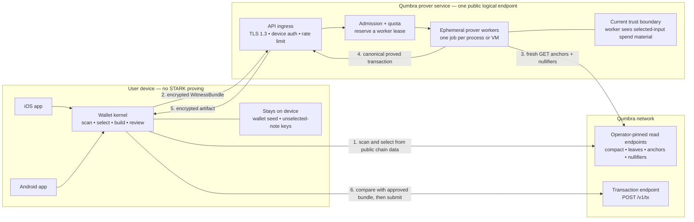

# Backend-assisted proving — feasibility and security handoff

**Status: FEASIBLE, NOT BUILT. The trust model and production security gates are
not decided. Do not expose the current paired-prover binary to the Internet.**
Paired with
[`backend-assisted-proving-security-zh.md`](backend-assisted-proving-security-zh.md).

Written 2026-08-23 after reopening phone self-proving. This document records one
product ruling and one technical finding:

- **DECIDED by Larry:** requiring users to operate a self-hosted persistent
  prover is too much friction and is out of scope. Do not build the product
  around a user's Mac, home server, or rented VM.
- **VERIFIED:** Qumbra can operate one public logical prover service for all
  wallets without changing `CONSENSUS_CFG`. It must be described honestly as
  **trusted assisted proving** under the current transaction protocol.

"One service" does not mean one process or one machine. The product surface can
be one endpoint while an admission queue dispatches jobs to multiple isolated
workers as demand grows.

---

## 1. Answer in one sentence

Yes: keep b16, let the phone select and approve a spend, send its
`WitnessBundle` over an authenticated encrypted channel to a Qumbra-operated
worker, return the proved transaction to the phone, and let the phone submit it.

This gives every supported phone a send path, keeps today's 148,625-byte
consensus wire size, and avoids a T2 re-mint or permanent dual verifier. The
price is not on the consensus wire: it is the service trust, privacy,
availability, and operating bill described below.

## 2. What already exists

The current split is already the correct *functional* seam:

1. The wallet scans, subtracts spent notes, selects inputs, constructs Merkle
   witnesses, fixes both outputs, and emits a versioned `WitnessBundle`.
2. A prover host decodes and revalidates that bundle, fetches fresh public
   anchors and nullifiers, proves, and returns canonical transaction bytes.
3. The iOS wallet checks the returned byte length and SHA3-256, then submits the
   exact bytes itself.

Relevant code at the revisions inspected for this handoff:

| repository | revision | seam |
|---|---:|---|
| `qumbra-lab` | `1c5a27b` | `crates/qumbra-wallet/src/bundle.rs`, `spend.rs`; `crates/qumbra-ffi/src/pairing.rs` |
| `qumbra-wallet-macos` | `4bdde1d` | `rust/src/bin/qumbra-paired-prover.rs` |
| `qumbra-wallet-ios` | `e3a9e2d` | `PairedProverPipe.swift`, `SendFlow.swift` |

The Mac channel already has a fresh 256-bit pairing secret,
ChaCha20-Poly1305 framing, direction-separated nonces, exact counters, bundle
validation, preflight, progress events, chunked artifacts, and an end-to-end
digest. Those are useful components. Its one-shot LAN threat model is not a
public-service security design.

## 3. The load-bearing trust fact

`WitnessBundle` is not an opaque proving hint. It serializes each selected
input's `sk`, value, `rho`, `rseed`, diversifier, and Merkle path
(`crates/qumbra-wallet/src/bundle.rs:33-40,385-401`). The root module comment
calls the artifact "spend authority for exactly one transaction" and restricts
it to the user's local trusted boundary.

That wording describes the intended honest handoff, not a cryptographic
restriction on a modified prover host. Qumbra's current transaction model has
spend-key knowledge inside the STARK and no separate per-spend authorization
signature held back by the phone. A malicious host can therefore:

1. read the selected notes' openings and membership witnesses;
2. ignore the approved output fields in the received bundle;
3. construct different outputs paying itself;
4. prove and submit that conflicting spend directly.

Checking the transaction returned to the phone does not close this attack: the
host can return an honest artifact while independently submitting the conflicting
one. The nullifier race decides which lands.

The blast radius is bounded but material:

- the service does **not** receive the wallet seed or keys for notes absent from
  this bundle;
- it can spend the full value of the selected real inputs, including value that
  was supposed to return as change;
- it sees the recipient/output plaintexts, amount, change, selected inputs,
  nullifiers, anchor, account or device identity, and source IP in one place.

Therefore a Qumbra-operated service is technically a temporary holder of enough
material to authorize the selected-note spend. Whether that has a legal label is
outside this document; technically it must not be marketed as trustless or
non-custodial under the current protocol.

## 4. Proposed public-service boundary

**Yes, the prover service must connect to Qumbra nodes.** The current preflight
fetches the node's current valid-anchor set and the nullifier history through the
current anchor tip. It refuses before allocating STARK work if the bundle's
anchor is no longer accepted, nullifier coverage is incomplete, or a selected
input is already spent (`crates/qumbra-wallet/src/spend.rs:358-405`). The prover
does not need wallet scan state, a wallet directory, or a submission credential.

The worker's node access is read-only preflight. The phone remains responsible
for `POST /v1/tx`. Both the worker's read endpoints and the wallet's expected
network identity are operator/app pinned; a request must never carry an
arbitrary node URL.

The admission service should not place plaintext witness bundles in a durable
queue. Prefer a two-stage protocol: the wallet first obtains a bounded worker
lease, then uploads the encrypted bundle only after capacity is reserved. If a
durable queue is unavoidable, it holds only an envelope encrypted to the worker
tier, with a short expiry and no edge/logging key able to decrypt it.

Each worker serves one job in a separate unprivileged process or VM and exits.
A long-lived coordinator may schedule work; the process that held a witness
must not be reused across users.

The phone remains the submitter. This does not remove the fundamental trust
fact in §3, but it reduces accidental submission authority, makes the approved
intent checkable, and keeps incomplete/duplicate recovery in the wallet's
existing typed flow.

## 5. P0 gates before any Internet pilot

| risk | fact in the current seam | required gate |
|---|---|---|
| Selected-input theft | the worker receives the input `sk` and witness | Explicitly accept and disclose the trusted-assisted model, or require §8's stronger authorization before launch |
| SSRF / internal-network reachability | the client supplies `scan_url` and `node_url`; `required_url` checks only an `http://` or `https://` prefix (`qumbra-paired-prover.rs:286-289,411-415`) | Remove URLs from the public request. Accept a network identifier and map it to operator-pinned endpoints. Deny worker access to loopback, private ranges, cloud metadata, and all other egress |
| Compute exhaustion | one b16 proof is roughly a 12–15 GB-class job; the real deployment target is unmeasured | Authenticate before admission; bound queue depth, jobs per device, global concurrency, proof wall time, and retries. Add cooperative cancellation or kill the worker on lease expiry |
| Pre-auth memory exhaustion | the server accepts an attacker-declared encrypted frame up to 128 MiB and allocates it before AEAD authentication (`qumbra-paired-prover.rs:180-213`) | Set a measured bundle ceiling near the real format size; authenticate a small fixed first message before allocating the payload |
| Client memory exhaustion | the phone accepts server-declared `byte_length` and `chunk_count`, then allocates `vec![None; chunks]` (`crates/qumbra-ffi/src/pairing.rs:585-599`) | Bound artifact bytes, chunk count, per-chunk bytes, event count, and aggregate response bytes. Derive chunk count from the declared byte length |
| Slow connection starvation | the current listener handles one connection synchronously and gives handshake I/O 30 seconds (`qumbra-paired-prover.rs:84-99`) | Put a bounded concurrent authenticated ingress in front; enforce header/read deadlines, per-source connection caps, and total unauthenticated memory caps |
| Witness persistence | ordinary heap copies may reach swap, core dumps, crash reports, tracing, or a reused allocator | No payload logs/traces; disable core dumps; keep secrets out of metrics and error text; avoid swap on workers; zeroize explicit buffers where possible; exit and destroy the worker after every job |
| Reusable bearer secret | the current symmetric key is derived from the QR secret and public server nonce, which is suitable only because each process creates a new secret | Do not reuse the QR protocol for a daemon. Enrol a per-install asymmetric device key, authenticate the service identity, use an ephemeral key exchange with forward secrecy, rotate/revoke devices, and bind a unique challenge to every job |
| Wrong network/config | the current request names URLs, not a pinned genesis and consensus configuration | Bind protocol version, network ID, genesis hash, and consensus-config label to request, preflight, artifact, and audit event; refuse any mismatch before proving |
| Malformed or substituted result | the phone currently proves only that bytes match the digest announced by the same server | Decode the returned `TxEntry` and compare anchor, nullifiers, commitments, fee, discovery, and rider against the approved bundle before submission. This catches bugs/substitution but does not defeat §3's direct-submit attack |
| Worker compromise and lateral movement | a public worker parses attacker data while briefly holding spend authority | Run unprivileged with a read-only image, no shell, no cloud credentials, no metadata access, minimal filesystem, strict syscall/network policy, and one tenant per process/VM; sign and pin deployed artifacts |

These are launch gates, not a future hardening list. The current binary passes
the security property it was designed for — one trusted phone on a trusted LAN
for one request — and should not be judged or deployed as if it already passed
this different bar.

## 6. Authentication, abuse control, and privacy are coupled

An anonymous endpoint that allocates 12–15 GB per request is an open compute
amplifier. A conventional user account solves quota attribution while creating
a durable wallet-to-identity link. IP-only limiting is both easy to evade and
unfair behind carrier NAT.

A reasonable starting shape is a per-install asymmetric device key created by
the wallet, with a service-issued quota credential. It authenticates a device,
not a legal identity. The design still owes a Sybil/cost decision: app
attestation, invite/quota tokens, anonymous rate-limit credentials, payment, or
some combination. No choice here is free, and the privacy property must be
written before implementation.

Minimum protocol properties regardless of that choice:

- unique, expiring job IDs bound to the authenticated request and bundle digest;
- idempotent status/result retrieval without retaining the plaintext bundle;
- one accepted lease cannot start two simultaneous proves;
- bounded retry semantics for a lost response;
- no recipient, amount, nullifier, bundle digest, IP, or device key in ordinary
  logs;
- separate access to abuse metadata and proving payloads, with short retention.

## 7. Capacity and availability

One public logical endpoint can serve everyone, but one prover process cannot.
The pilot can deliberately start with one queued worker; production capacity is
horizontal workers, each with memory reserved for exactly one proof.

Before sizing anything, measure the current circuit on the actual deployment
CPU and memory configuration:

- peak RSS and peak committed memory;
- cold and warm prove time;
- time and memory variance under one worker per host versus safe concurrency;
- cancellation latency and memory release after a killed job;
- bundle and artifact byte distributions;
- cost per successful proof and per refused/abandoned job.

Central proving also becomes a censorship and availability dependency. The
service needs a published degradation mode, bounded queue estimates in the UI,
more than one failure domain before it is the only send path, and an answer for
what wallets do during a regional or total outage. "Try later" is honest; an
unbounded spinner is not.

## 8. Paths to a stronger trust model

| path | consensus change | what it buys | residual cost/risk |
|---|---|---|---|
| Trusted Qumbra service | none | Fastest route; keeps b16 and today's wire size | Qumbra/worker can steal selected inputs; privacy, censorship, and breach risk remain |
| Attested confidential VM | none in principle | Reduces ordinary operator/cloud access to plaintext witnesses | Trust moves to hardware, firmware, attestation, measured image, and side-channel posture; prover memory fit and performance are unmeasured |
| Phone-held transaction-intent authorization | yes | A worker can know the proving witness but cannot authorize different outputs | Requires a distinct secret that never enters the bundle, a note/commitment and verifier binding to it, canonical intent bytes, PQ authorization choice, migration rules, and new size/performance measurements |
| MPC / encrypted outsourced proving | likely extensive | Tries to hide the witness cryptographically from every single worker | Research project, large performance/complexity risk; not a launch path on present evidence |

The authorization path must bind at least network/genesis, selected-note
identity or nullifiers, anchor/freshness rule, both output commitments,
discovery bytes, rider, fee, and an expiry/replay domain. An API-layer signature
alone is insufficient: the node or the proved statement must reject a
conflicting transaction that lacks the phone-only authorization.

No such authorization key exists in today's note format. Adding one is a
protocol project, not a backend refactor.

## 9. Relationship to the b4 decision

Backend-assisted proving is the missing branch in the reopened phone decision:

| choice | all supported phones can send | consensus wire | T2 consequence | enduring dependency |
|---|---|---:|---|---|
| b4 local prove + fallback | only through a fallback on low-memory devices | about 236 KB on stale pre-mint data; current value owed | re-mint or permanent dual verifier | fallback prover still exists |
| Qumbra backend at b16 | yes | 148,625 bytes today | none | trusted, available prover service |
| current per-send Mac pairing | only when the user operates a Mac each time | 148,625 bytes today | none | rejected product UX |

The shared backend therefore removes the reason to change `CONSENSUS_CFG` merely
to make every phone capable of sending. It does not answer whether Larry accepts
the trusted-assisted model for mainnet, or whether §8's stronger authorization
must land first.

If the backend direction is selected, b4/b8 phone measurements are no longer a
prerequisite for that service. They remain useful only if local self-proving is
kept as a separate future product goal.

## 10. Decisions and evidence still owed

Before implementation:

1. Decide the launch scope: T2-only experiment, optional mainnet path, or the
   default/only phone send path.
2. Decide the minimum trust bar: disclosed trusted service, attested worker, or
   phone-held protocol authorization.
3. Decide the device credential and abuse-control model without silently
   creating a wallet identity system.
4. Set retention, logging, incident-response, queue/SLO, and outage policies.
5. Threat-model the final protocol and deployment separately before exposing a
   listener.

Evidence to collect before capacity or cost claims:

1. Current b16 peak memory and prove-time distribution on the intended worker
   host.
2. Actual bundle/artifact bounds to replace both 128 MiB protocol ceilings.
3. A red-team drill covering SSRF, slowloris, unauthenticated allocation,
   authenticated job flooding, malicious result sizes, disconnect/cancel, core
   dump, log leakage, and worker escape.
4. An end-to-end drill proving that the phone refuses every artifact whose
   public transaction surface differs from the approved bundle.

## 11. Scope at this handoff

- User-operated persistent proving is **out of scope by product ruling**.
- No backend service, daemon, cloud resource, account system, or protocol change
  was built in producing this document.
- `CONSENSUS_CFG` remains untouched.
- The current paired-prover code remains a trusted-LAN, one-request tool.
