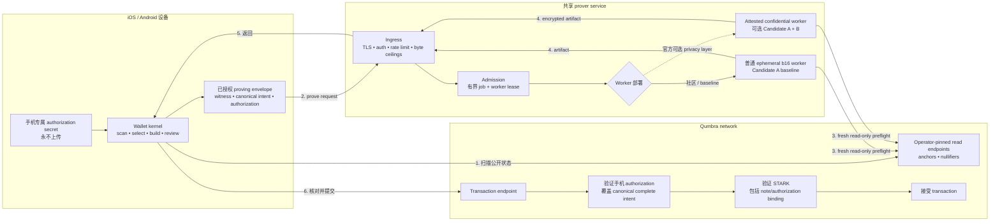

# 远程证明 —— 安全基础裁定

**状态：2026-08-23 已决定，不是 implementation approval。Candidate A 是真实价值
remote proving 的强制基础；Candidate B 是可选的 defense-in-depth，不是资金安全的
trust root。本裁定不选择 authorization primitive，也不修改 binding design spec。**
英文权威版：
[`remote-proving-candidate-ruling.md`](remote-proving-candidate-ruling.md)。

本文解决 [`remote-proving-decision-zh.md`](remote-proving-decision-zh.md) 里的路线选型问题。
那份记录继续作为详细上线门槛；本文只记录选择及其后果。

---

## 1. 裁定

**Candidate A —— 共识绑定、由手机持有的 spend authorization —— 是所有承载真实价值的
共享 prover 的强制安全基础。** 即使 prover、service operator、cloud 与 submission path
都是恶意的，node 也必须拒绝任何修改手机所批准完整 intent 的交易。

**Candidate B —— 由钱包验证的 attested confidential worker —— 是叠加在 A 之上的可选
部署层。** 官方服务应当并行测量它，也可以用它降低 witness 可见性；但 B 不能替代 A，
也不是资金安全的上线前提。B-only 部署可以做无价值实验，不得承载真实价值。

所以，推荐的 production 组合是：**A，加上在实测 fit 与 operational trust 可接受时的
B**。社区或其他 prover 需要支持 A，但不必复制 Qumbra 的 confidential-compute 部署。

## 2. 为什么 A 强制、B 可选

### 2.1 Integrity 属于协议

A 让每个 node 都能独立验证 authorization 决策。Prover 可以看见 witness，也可以拒绝
服务，但不能重定向 selected funds。即便 operator 恶意、cloud account 被攻破、worker
isolation 失效，或者 prover 直接提交交易，这个性质仍成立。

B 保护的是部署边界。它的保证依赖 CPU/firmware、cloud isolation、attestation 与
revocation service、measured image、wallet verification，以及 side-channel 假设。这些
都是有价值的屏障，但不应决定谁有权花用户的钱。

### 2.2 两个候选只有一个安全的组合顺序

已有 A 保护的 service 可以添加 B，而不改共识。若先按 B 上线，再补 A，就必须让协议、
circuit、wire、wallet、verifier 与 activation boundary 一起移动。T2 已 minted、未
launched，所以 A 的 re-mint 窗口现在还开着；B 不依赖这个窗口。

### 2.3 A 允许不止一个 prover operator

一旦 node 强制执行手机 authorization，Qumbra service 就只是一个 provider，不再是永久
trust root。社区节点、矿池或未来的 proving market 都能服务同一个协议。B-only proving
则要求 wallet 永久信任获准的 attestation policy 及其 operator ecosystem。

### 2.4 B 仍有真实的隐私价值

A 不会向普通 worker 隐藏 witness。Service 仍可能关联 selected notes、amount、recipient
material、nullifiers、device identity、IP 与 timing，也会拿到隐私敏感的 `nk` 材料。
如果 encryption 只在已经验证的 worker 内终止，B 可以降低官方 service 对 payload 的
可见性。但 ingress metadata 与 on-chain timing 仍可见，所以 B 是 privacy hardening，
不是 anonymity。

当前目标级 attestation 也不是端到端 post-quantum trust chain。AMD 为 SEV-SNP
attestation report 规定 ECDSA P-384 signature；Intel 的 TDX quote/certification path
使用 ECDSA。这不表示这些平台不能用；它进一步说明 attestation 不应成为唯一
authorization root。

## 3. 决策矩阵

| 部署 | operator 恶意时资金不能被重定向 | witness confidentiality | 协议后果 | 裁定 |
|---|---|---|---|---|
| A：普通 worker + 手机 authorization | 是，由每个 node 强制执行 | 否 | T2 re-mint 级变更 | **强制 baseline** |
| B only：confidential worker | 只有完整 TEE/attestation chain 成立时 | 降低；ingress metadata 仍在 | 原则上不改共识 | **真实价值场景不允许** |
| A + B：confidential deployment 内的手机 authorization | 是；即使 B 失效，A 仍强制执行 | 在 B 的明示假设下降低 | A 的协议改动 + B 的部署工作 | **实测 fit 通过时，官方服务的推荐组合** |

如果 A+B 部署里的 B 降级，或者 attestation policy 被撤销，privacy 或 availability 可以
降级，但这个故障不得变成重定向资金的权限。

## 4. 选定架构

手机保留 authorization secret，并通常负责提交返回的 artifact。Prover 接收已授权的
proving envelope，从 operator-pinned、read-only node endpoints 获取 fresh anchors 与
nullifiers，然后返回 proof 与 transaction。客户端请求永远不能选择 worker 的 node URL。

手机侧核对与提交继续作为 defense-in-depth，但不是 anti-theft boundary：恶意 prover 可以
直接提交，所以 node 的 Candidate A verification 才是权威判断。

## 5. 后果与 invariants

1. **A 是 T2 re-mint 级协议变更。** Note 或 recipient-key binding、AIR/public values、
   transaction wire/identity、node verification、genesis parameters、activation 与
   migration 必须是一份整体设计。
2. **必须先修正 binding design spec。** 它当前“one monolithic STARK；没有 per-spend
   signatures”的决定，不能被 lab implementation 悄悄绕过。
3. **B-only 不是承载真实价值的捷径。** 它只可用于明确隔离、无价值的 service-mechanics
   或 capacity experiment。
4. **A-only service 必须诚实说明 privacy boundary。** 它不得声称 witness confidential，
   并且需要明确 retention、logging、access、incident-response 与 metadata-linkability
   rules。
5. **A+B service 继续以 A 为权威。** Attestation failure 可以拒绝 job，但绝不能授权
   transaction 或绕过 node verification。
6. **Prover 的 node access 只读并由 operator 固定。** Wallet 通常通过自己的固定
   transaction endpoint 提交。
7. **用户运营常驻 prover 继续排除。** A 允许其他 operator，但不要求用户自己运营。

## 6. 仍未决定的部分

选择 A **不表示**接受 hash-OTS 草案或任何 signature primitive。Authorization spike
至少必须比较：

- 标准化 stateless leaf，初始 frontrunner 为 ML-DSA；
- 完整实例化、具有 rollback-safe state 方案的标准 WOTS+；以及
- 作为实测 comparator 的 random-index WOTS+，不得把它当成 SLH-DSA。

Spike 必须关闭 dummy-slot rule、canonical complete intent、exact codecs/vectors、mobile
key lifecycle/restore、multi-device behavior、wire bytes、prover RSS/time、node
verification time 与 privacy impact。[`remote-proving-decision-zh.md`](remote-proving-decision-zh.md)
§6 的 P0 blockers 仍然开放。

本文不选择 confidential-compute vendor、cloud、instance family、attestation policy、
API、queue、retention design 或 capacity plan。

## 7. 执行顺序

1. 先把 authorization spike 作为研究运行，从标准化 stateless-leaf 形状起步，并保留
   WOTS+ variants 作为 comparators。
2. Protocol 形状达到可评审状态后，写一份带日期的 design-spec correction，允许
   consensus-bound、phone-held authorization。它必须先于 circuit/wire implementation
   落地。
3. 跨 circuit、public values、wire、node verifier、wallet、activation 与 migration 规定
   T2 re-mint 变更；只有 protocol review 通过后才实现。
4. 并行在精确 confidential instance 上运行无价值 B pilot，测量 b16 memory、latency、
   queue behavior、teardown、attestation negatives 与 mobile verification。
5. 在 A 通过 [`remote-proving-decision-zh.md`](remote-proving-decision-zh.md) §8 的所有
   applicable gates 前，不上线承载真实价值的 shared prover。如果官方 service 声称
   confidential processing，B 的 applicable gates 也必须通过。

## 8. 证据与范围

- 详细 shared-service topology、threat model 与 operational controls 继续记录在
  [`backend-assisted-proving-security-zh.md`](backend-assisted-proving-security-zh.md)。
- Authorization research 与未关闭的 WOTS+ blockers 继续记录在
  [`hash-ots-spend-authorization-zh.md`](hash-ots-spend-authorization-zh.md)。
- [NIST FIPS 204](https://csrc.nist.gov/pubs/fips/204/final) 规定 ML-DSA。
- [AMD SEV-SNP specification](https://www.amd.com/content/dam/amd/en/documents/epyc-technical-docs/specifications/56860.pdf)
  规定 attestation report 及其 ECDSA P-384 signature。
- [Intel TDX module base specification](https://cdrdv2-public.intel.com/865787/intel-tdx-module-base-spec-348549007.pdf)
  规定 TDX quote 与 ECDSA certification path。
- [Azure confidential VM overview](https://learn.microsoft.com/en-us/azure/confidential-computing/confidential-vm-overview)
  证明 SEV-SNP/TDX 级部署是可行工程选项，并不能证明它应成为协议 authorization root。

本裁定没有改动 code、circuit、wire、genesis、cloud resource 或 deployment。
`CONSENSUS_CFG` 未触碰。
