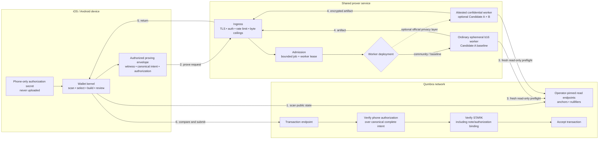

# Remote proving — security-basis ruling

**Status: DECIDED 2026-08-23, NOT IMPLEMENTATION APPROVAL. Candidate A is
mandatory for real-value remote proving. Candidate B is optional
defense-in-depth and is not a funds-safety trust root. This ruling does not
select an authorization primitive or amend the binding design specification.**
Paired with
[`remote-proving-candidate-ruling-zh.md`](remote-proving-candidate-ruling-zh.md).

This document resolves the route-selection question in
[`remote-proving-decision.md`](remote-proving-decision.md). That record remains
the detailed launch gate; this one records the choice and its consequences.

---

## 1. The decision

**Candidate A — consensus-bound, phone-held spend authorization — is the
mandatory security basis for every shared prover that carries real value.** A
node must reject any transaction that changes the complete phone-approved
intent, even when the prover, service operator, cloud, and submission path are
malicious.

**Candidate B — a wallet-verified attested confidential worker — is an
optional deployment layer on top of A.** The official service should measure
it in parallel and may use it to reduce witness visibility, but B is not a
substitute for A and is not a launch prerequisite for funds safety. A B-only
deployment may be used for a valueless experiment; it may not carry real
value.

The preferred production composition is therefore **A, plus B where its
measured fit and operational trust are acceptable**. Community or alternative
provers need A but do not need to reproduce Qumbra's confidential-compute
deployment.

## 2. Why A is mandatory and B is optional

### 2.1 Integrity belongs in the protocol

A makes the authorization decision independently verifiable by every node.
The prover can see the witness and can refuse service, but it cannot redirect
the selected funds. That property survives a malicious operator, compromised
cloud account, broken worker isolation, and direct submission by the prover.

B protects a deployment boundary. Its guarantee depends on CPU and firmware,
cloud isolation, attestation and revocation services, the measured image,
wallet verification, and side-channel assumptions. Those are valuable
barriers, but they should not decide who is allowed to spend a user's money.

### 2.2 The candidates compose in only one safe direction

B can be added to an A-protected service without changing consensus. Adding A
after launching on B requires the protocol, circuit, wire, wallet, verifier,
and activation boundary to move together. T2 is minted but not launched, so
the re-mint window for A is open now; B does not depend on that window.

### 2.3 A permits more than one prover operator

Once the node enforces the phone's authorization, Qumbra's service becomes one
provider rather than the permanent trust root. Community nodes, pools, or a
future proving market can serve the same protocol. B-only proving instead
requires wallets to keep trusting an approved attestation policy and its
operator ecosystem.

### 2.4 B still has real privacy value

A does not hide the witness from an ordinary worker. The service may still
link selected notes, amount, recipient material, nullifiers, device identity,
IP, and timing, and it receives privacy-sensitive `nk` material. B can reduce
payload visibility for the official service if encryption terminates only
inside a verified worker. Ingress metadata and on-chain timing remain visible,
so B is privacy hardening rather than anonymity.

Current target-class attestation is also not an end-to-end post-quantum trust
chain. AMD specifies ECDSA P-384 signatures for SEV-SNP attestation reports,
and Intel's TDX quote/certification path uses ECDSA. This does not make the
platforms unusable; it is another reason not to make attestation the exclusive
authorization root.

## 3. Decision matrix

| deployment | funds cannot be redirected when the operator is malicious | witness confidentiality | protocol consequence | ruling |
|---|---|---|---|---|
| A: ordinary worker + phone authorization | yes, enforced by every node | no | T2 re-mint-class change | **mandatory baseline** |
| B only: confidential worker | only while the complete TEE/attestation chain holds | reduced; ingress metadata remains | no consensus change in principle | **not allowed for real value** |
| A + B: phone authorization inside a confidential deployment | yes, still enforced by A if B fails | reduced under B's stated assumptions | A's protocol change plus B's deployment work | **preferred official-service composition where measured fit passes** |

If B degrades or its attestation policy is withdrawn in an A+B deployment,
privacy or availability may degrade, but the failure must not become authority
to redirect funds.

## 4. Selected architecture

The phone retains the authorization secret and normally submits the returned
artifact. The prover receives the authorized proving envelope, obtains fresh
anchors and nullifiers from operator-pinned read-only node endpoints, and
returns a proof and transaction. A client request never chooses the worker's
node URL.

Phone-side comparison and submission remain defense-in-depth. They are not
the anti-theft boundary: a malicious prover can submit directly, so the node's
Candidate A verification is authoritative.

## 5. Consequences and invariants

1. **A is a T2 re-mint-class protocol change.** Note or recipient-key binding,
   AIR/public values, transaction wire and identity, node verification,
   genesis parameters, activation, and migration must be one design.
2. **The binding design specification must be corrected first.** Its current
   "one monolithic STARK; no per-spend signatures" decision cannot be silently
   bypassed by lab implementation.
3. **B-only is not a real-value shortcut.** It is permitted only for an
   explicitly isolated, valueless service-mechanics or capacity experiment.
4. **An A-only service must state its privacy boundary honestly.** It must not
   claim witness confidentiality, and it needs explicit retention, logging,
   access, incident-response, and metadata-linkability rules.
5. **An A+B service keeps A authoritative.** Attestation failure may refuse a
   job; it must never authorize a transaction or bypass node verification.
6. **The prover's node access is read-only and operator-pinned.** The wallet
   normally submits through its own pinned transaction endpoint.
7. **User-operated persistent proving remains out of scope.** A enables other
   operators; it does not require users to operate one.

## 6. What remains undecided

Selecting A does **not** accept the hash-OTS draft or any signature primitive.
The authorization spike must compare at least:

- a standardized stateless leaf, with ML-DSA as the initial frontrunner;
- standardized WOTS+ with its complete instantiation and rollback-safe state
  story; and
- random-index WOTS+ as a measured comparator, without treating it as SLH-DSA.

The spike must close the dummy-slot rule, canonical complete intent, exact
codecs and vectors, mobile key lifecycle and restore, multi-device behavior,
wire bytes, prover RSS/time, node verification time, and privacy impact. The
P0 blockers in [`remote-proving-decision.md`](remote-proving-decision.md) §6
remain open.

No confidential-compute vendor, cloud, instance family, attestation policy,
API, queue, retention design, or capacity plan is selected here.

## 7. Execution order

1. Run the authorization spike as research, starting from the standardized
   stateless-leaf shape and keeping WOTS+ variants as comparators.
2. Once the protocol shape is reviewable, write the dated design-spec
   correction that permits consensus-bound phone-held authorization. It must
   land before circuit or wire implementation.
3. Specify the T2 re-mint change across the circuit, public values, wire, node
   verifier, wallet, activation, and migration; then implement only after the
   protocol review passes.
4. In parallel, run a valueless B pilot on the exact confidential instance to
   measure b16 memory, latency, queue behavior, teardown, attestation negatives,
   and mobile verification.
5. Launch no real-value shared prover until A passes all applicable gates in
   [`remote-proving-decision.md`](remote-proving-decision.md) §8. If the
   official service claims confidential processing, B's applicable gates must
   pass too.

## 8. Evidence and scope

- The detailed shared-service topology, threat model, and operational controls
  remain in
  [`backend-assisted-proving-security.md`](backend-assisted-proving-security.md).
- The authorization research and unresolved WOTS+ blockers remain in
  [`hash-ots-spend-authorization.md`](hash-ots-spend-authorization.md).
- [NIST FIPS 204](https://csrc.nist.gov/pubs/fips/204/final) specifies ML-DSA.
- [AMD SEV-SNP specification](https://www.amd.com/content/dam/amd/en/documents/epyc-technical-docs/specifications/56860.pdf)
  defines the attestation report and its ECDSA P-384 signature.
- [Intel TDX module base specification](https://cdrdv2-public.intel.com/865787/intel-tdx-module-base-spec-348549007.pdf)
  defines the TDX quote and ECDSA certification path.
- [Azure confidential VM overview](https://learn.microsoft.com/en-us/azure/confidential-computing/confidential-vm-overview)
  is evidence that SEV-SNP/TDX-class deployment is an engineering option, not
  evidence that it should be the protocol's authorization root.

No code, circuit, wire, genesis, cloud resource, or deployment changes under
this ruling. `CONSENSUS_CFG` remains untouched.
