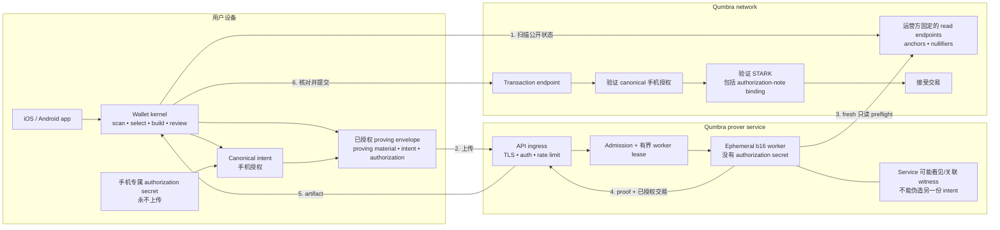
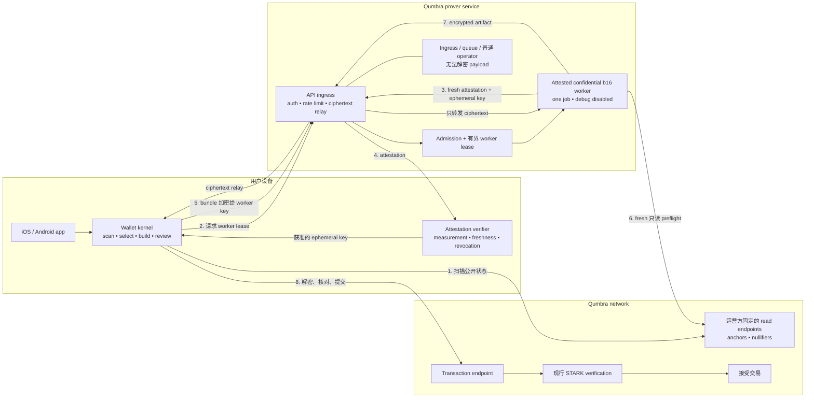

# 远程证明 —— 当前决策记录

**状态:当前决策,不是 implementation approval。Candidate A 已选为真实价值场景的
强制安全基础;它的 authorization primitive 仍未选定。Candidate B 是可选
defense-in-depth,不是资金安全 trust root。在 A 通过 §8 applicable launch gates 之前,
公网 prover 不得承载真实价值。**
英文权威版:[`remote-proving-decision.md`](remote-proving-decision.md)。

写于 2026-08-23,接续 PR #618、PR #619 与后续安全复核。本文是 `qumbra-lab` 里
remote proving 的权威入口。早期文档继续保留为证据与设计记录;§10 说明该怎么读。

带日期的路线选择另行记录在
[`remote-proving-candidate-ruling-zh.md`](remote-proving-candidate-ruling-zh.md)。

本文不会悄悄修改 Qumbra 的 binding design spec。实现已经选定的 protocol-level
authorization 前,必须给当前"每笔交易一个 monolithic STARK;没有 per-spend
signature"决策做一份带日期的 design-repo 修正。

---

## 1. 一句话决策

Qumbra 可以为所有支持手机研究一个共享逻辑 prover service,但现行 trusted
`WitnessBundle` 交接不得承载真实价值:上线前必须有共识绑定、任何 prover 都无法伪造的
手机持有授权;由钱包验证的 attested confidential worker 可以另外降低 witness 可见性。
用户运营常驻 prover 不在范围内。

## 2. 已经决定的部分

1. **产品不得要求 self-host。** 用户的 Mac、家用服务器或租用 VM 不能成为常驻 send
   路径。
2. **共享证明在算力上可行。** 一个公共 endpoint 可以把任务派给多个 ephemeral
   workers;"一个 service"不等于一个进程。
3. **现行协议不能承载真实价值。** 今天的 bundle 给 worker 足够的 selected-input
   材料,让它可以构造、证明并提交一笔付给自己的冲突交易。
4. **手机提交只是工程卫生,不是防盗。** 它把 submission credential 与类型化恢复留在
   钱包,但恶意 worker 仍能自己向公共 node 提交。
5. **盗币与可关联性需要两份独立上线审查。** 禁止 output redirect 不会阻止 prover 或
   ingress 把 inputs、outputs、amount、recipient、nullifiers、device identity、IP 与
   timing 拼在一起。
6. **Prover 需要只读 node access。** 分配证明工作前,它从运营方固定 endpoints 获取
   fresh anchors/nullifiers。客户端请求不得提供任意 node URL。

安全基础已经选定。本文没有选择 authorization primitive、backend implementation 或
confidential-compute target,也没有实现任何共识变更。

## 3. 诚实的路线比较

| 路线 | 所有支持手机都能 send | 不能盗币 | 不能看见/关联 | T2 后果 | 当前裁决 |
|---|---|---|---|---|---|
| 用户运营常驻 prover | 只有用户运营时才行 | 取决于 operator | 诚实时留在本地 | 无 | **按产品裁决排除** |
| b4 本地证明,无远程 fallback | 不行;低内存手机被排除 | 本地可以 | 本地可以 | re-mint 或永久双 verifier | 无法完整覆盖产品目标 |
| b4 本地证明 + 远程 fallback | 原则上可以 | fallback 仍需 Candidate A authorization | fallback 除非 confidential,否则仍能看见/关联 | b4 re-mint + remote-prover 成本 | 相比 shared service 没有安全捷径 |
| Trusted shared b16 prover | 可以 | **失败** | **失败** | 无 | **真实价值场景排除**;只可做无价值 mechanics experiment |
| 共享 b16 prover + 手机持有 authorization | 可以 | 只有共识绑定手机批准的完整 intent 才通过 | 普通 worker 下**失败** | re-mint 级协议变更 | **已选定的强制基础**;primitive 未选 |
| 没有 A 的 attested confidential b16 worker | 原则上可以 | 只有完整 attestation/hardware/isolation chain 成立时才通过 | 可减少 payload 可见性;ingress metadata 仍在 | 原则上不需 protocol re-mint | **真实价值场景不能单独采用**;可选叠加在 A 上 |
| MPC 或密码学隐藏的 outsourced proving | 未知 | 目标是通过 | 可能减少 payload 可见性 | 很可能大改 | 延后研究 |

因此,产品比较不是"b4 对相信 Qumbra"。选定的远程路线是带 Candidate A authorization
的 b16 proving;Candidate B 通过自己的 fit/trust gates 后,可以把它部署在 confidential
compute 里。

### 候选架构图

Baseline topology 的 service 主干不变:wallet 从固定 read endpoints 扫描,一个公共逻辑
service 给 ephemeral workers 发 lease,worker 用固定的只读 node access 做 preflight,
通常仍由 wallet 提交返回的交易。两个候选的区别在 security boundary。

#### 候选 A —— 已选定的共识绑定手机授权

普通 service 仍可能观察并关联 witness。它的安全声明更窄:手机保留 authorization
secret;worker 一旦改动已授权 intent 或 note binding,node 就会拒绝交易。

这条路线会改共识。Node 先验 authorization,再做昂贵的 STARK verification;STARK 随后
必须证明 authorization public values 属于同一批 hidden inputs。

#### 候选 B —— 已被排除单独使用的历史 B-only 候选

原则上这条路线保留今天的 consensus transaction。Wallet 先验证 fresh worker
attestation,并把 ephemeral encryption key 绑定到获准 image/configuration。只有该 worker
boundary 能解密 bundle;ingress、admission、durable infrastructure 与普通 operator 都只能
看见 ciphertext。

这条路线改 transport/trust boundary,而不是 transaction format。Attestation、encryption、
hardware、firmware、image measurement 与 side-channel assumptions 都属于它的安全声明。
Ingress metadata linkability 仍然存在。

本图继续保留为 B-only trust boundary 记录。选定的 A+B 组合见
[`remote-proving-candidate-ruling-zh.md`](remote-proving-candidate-ruling-zh.md) §4。

## 4. 当前 trusted 交接不得上线

`WitnessBundle` 带有每个 selected input 的 spend secret 与 note opening。今天的交易里
没有另一份手机专属授权。被修改的 worker 可以无视批准 outputs,另造一组付给自己的
outputs,证明那笔交易并直接提交,与钱包交易抢跑。手机核对 artifact 看不到也挡不住这次
独立提交。

爆炸半径只覆盖 selected real inputs;服务拿不到 wallet seed 或无关 notes 的 openings。
但这个边界不会让 selected-input theft 变成可接受的产品性质。

完整 data flow、Mermaid 架构、Internet threat surface、queue/worker 边界、abuse controls
与容量证据继续记录在
[`backend-assisted-proving-security-zh.md`](backend-assisted-proving-security-zh.md)。

## 5. 候选 A —— 授权必须满足的 invariant

目前没有选定 signature primitive。Protocol-level authorization 只有同时保持以下
invariants 才可以接受:

1. 手机持有一把永不进入 proving bundle 的 authorization secret。Worker 只拿 AIR
   必需的 proving material。
2. 电路把公开 authorization value 绑定到同一个 hidden input note,也就是它正在证明
   membership 与 nullifier 的那一个。只在 proof 旁放一把 API-layer key 不够。
3. 唯一 canonical intent 至少覆盖 domain/protocol version、network/genesis、anchor、
   两个 nullifiers、两个 output commitments、bucket/fee、discovery/rider bytes 的 hash、
   所有 authorization public values,以及未来每个有共识语义的 transaction field。
4. Node 重算 intent,并在花 STARK verification 成本之前验证手机授权。
5. 两个固定 input slots 保持同一 public shape。Single-real-input dummy path 必须有明确
   authorization 规则,且不能泄露真实 input 数。
6. Transaction ID、body/P2P codecs、mempool identity、replay handling 与 activation
   boundary 都规范绑定新字段。

这是一项 T2 re-mint 级变更:note 或 recipient-key binding、AIR/public values、transaction
wire、node verification、genesis parameters 与 migration 必须一起移动。

## 6. Hash-OTS 是研究候选,不是决策

[`hash-ots-spend-authorization-zh.md`](hash-ots-spend-authorization-zh.md) 找到了一条有用的
结构接缝:把每地址 authorization-key-tree root 写进 `rkm`,每次花费用一个 public leaf,
在 STARK 里证明 leaf membership,并由 node 原生验签。因为 `rkm` 的 Keccak rate 有空位,
绑定一份 256-bit root 可能不需要额外 `ROLE_ARKM` permutation。

这条 insight 保留。但具体 WOTS+ 构造按现稿**不接受**:

| 严重度 | Blocker | 后果 |
|---|---|---|
| P0 | **State rollback 与 key reuse。** Signature 可能已经离开手机却未上链。Crash、旧 backup restore、并发设备、被扣留或失败的 job 都可能让同一个 OTS index 再用一次。扫链找不到从未落链的 signatures。 | WOTS+ state 一旦复用就失去 forgery guarantee。当前 wallet threat model 没有 rollback-proof、multi-device-safe state。 |
| P0 | **Signature 实例不完整。** "Keccak-based WOTS+"没有规定 `F`、`PRF`、public `SEED`、`ADRS`、L-tree/public-key compression、精确 domain separation 与 canonical vectors。RFC 8391 把 WOTS+ `w` 限定为 `{4,16}`;文档的 `w=256` 不是该标准参数。 | 32-byte public-key 声明、verifier、安全论证与 wire 估算都还不是协议规格。 |
| P0 | **Hidden dummy input 未定义。** 当前 slot 1 可以是 off-tree、由 prover 创造的 dummy,但建议的 node rule 要求两份合法 signatures,电路要求两条 authorization paths。 | Fixed-shape privacy property 与 acceptance rule 不完整。 |
| P1 | **成本都是估算。** Address-tree generation/cache、2^19 peak RSS/time、proof bytes、node verification 与 phone signing 都未测。 | 约 163 KB 与手机 latency 不能用来决定路线。 |
| P1 | **公开 `nk` 仍有隐私代价。** 去掉 `sk` 能阻止 prover 授权,但任意 prover 仍会拿到 full-viewing-class material 与完整 selected-spend 关系。 | "任何 prover 不能盗币"不等于"任何 prover 都是 private"。 |

State 风险不是文档细节。RFC 8391 警告复用 secret-key state 会失去安全保证;NIST
SP 800-208 要求 signature 导出之前,先把 next index 写进 nonvolatile storage。见
[RFC 8391 §1.1](https://www.rfc-editor.org/rfc/rfc8391.html#section-1.1)与
[NIST SP 800-208](https://csrc.nist.gov/pubs/sp/800/208/final)。

### Stateless leaf 对照项

Authorization spike 必须把 WOTS+ 与标准化 stateless signature leaf 做比较,首个对照是
ML-DSA。一份候选形状把 `H(ML-DSA public key)` leaves 的 Merkle root 写进 `rkm`;
node 在 STARK 外核对完整 public key/signature,电路仍只证明 32-byte leaf 的 membership。

该形状复用 key 可能让同一个 leaf 的使用相互关联,但不会破坏 signature
unforgeability。按 hash-OTS 文档自己的 ML-DSA-44/WOTS+ 大小,两个固定 inputs 相对它的
WOTS+ 行多约 3,112 bytes。这只是纸面算术,不是 wire claim。Tree-generation cost、
public-key bytes、proof size、node time、mobile time、privacy 与精确标准参数必须一起实测。

其他标准化 stateless 候选也可以进入比较。任何 custom signature construction 都必须先
经过独立 cryptographic review 与 published test vectors,才能继续。

## 7. 候选 B —— 可选 attested confidential worker

Attested confidential VM 是当前一条原则上能保留今天 consensus transaction、同时在
明示假设下不让普通 Qumbra/cloud operator 读取 witness 的路线。它不是普通的
TLS-to-VM,也不足以在没有 A 时独自成为真实价值 security basis。

钱包必须验证 ephemeral encryption key 属于获准的 worker image/configuration,再把
bundle 直接加密给它。Ingress/queue 不得解密。Measurement 必须 pin prover、consensus
config、protocol version、node allowlist、debug-disabled 状态与 result-encryption 行为。

部署或提出 confidentiality claim 之前,精确 SEV-SNP/TDX 级目标必须证明:

1. 当前 12–15 GB 级 b16 job 的 peak private memory、cold/warm proof time、proof bytes、
   failure behavior 与成本;
2. iOS/Android 都能验证 fresh、correct、non-debug、non-revoked attestation,并覆盖 negatives;
3. bundle 在 ingress、queue、host、snapshot、swap、crash collection 与 operator
   observability 全程加密;
4. rollback、replay、cancellation、teardown 与 regional outage 行为;
5. 明写 hardware、firmware、cloud、side-channel 与 availability trust。

Attestation 自己不能消除 linkability。Ingress 仍可关联 device identity、IP、timing
与随后上链的 transaction。

## 8. 真实价值上线门槛

公共 real-value prover 被阻塞,直到 Candidate A 通过所有 applicable gates。如果官方
service 还声称 Candidate B confidentiality,B 也必须通过自己的 applicable gates:

1. **不能盗币:**对抗性 prover/operator 无法授权手机没批准的 outputs 或 semantic fields。
2. **隐私写清楚:**设计明说谁能观察/关联 witness、device、IP、timing 与 transaction,
   并写清 retention/logging rules。
3. **容量与可用性已经实测:**peak memory、time distribution、queue policy、cancellation、
   retry、regional failure 与成本必须是证据,不能是估算。
4. **Internet boundary 已加固:**大内存分配前先认证;实测 request/response ceilings;无 client
   URLs;固定 egress;有界 jobs;ephemeral workers;没有 plaintext durable queue、core dump
   或 witness log。
5. **需要时完成 consensus migration:**primitive、AIR、public values、wire、verifier、
   transaction identity、genesis/re-mint 与 legacy behavior 只有一份 activation plan。
6. **对抗性端到端测试通过:**field rewrite、stale/wrong attestation、duplicate/replay、dummy
   shape、disconnect、恶意 sizes 与 worker escape 都在真实 verification seams 上覆盖。

通过这些门槛之前,trusted worker 只可用于无真实价值、明确隔离的 service-mechanics
experiment。

## 9. 工作顺序

0. **独立加固:**把 paired-prover 两边的 128 MiB protocol ceilings 换成实测
   bundle/artifact ceilings,从 byte limits 推导 chunk count,并加 boundary tests。它不选
   架构。
1. **Authorization spike:**端到端规定并比较标准 WOTS+、标准 stateless signature leaf
   与 random-index WOTS+ leaf,覆盖 dummy semantics、canonical intent、exact codecs、
   rollback/multi-device、wire bytes、prover RSS/time、node time、address creation、
   restore 与 privacy。Random-index 那一行必须把重复 leaf 当作 acceptance 上的灾难性
   事件,对每个能放进 2^19 的 depth-`D` tree 计算 ideal-uniform birthday bound
   `q(q−1)/2^(D+1)`,再叠加 multi-wallet/multi-target 风险。单棵 random-leaf tree 不是
   SLH-DSA;没有 FORS 与 hypertree construction,就不能继承
   [FIPS 205](https://csrc.nist.gov/pubs/fips/205/final) 的安全论证。
2. **Confidential-worker lane:**在精确目标 confidential instance 上跑今天的 b16 电路,
   并完成 mobile attestation negatives。
3. **Security-basis selection —— 2026-08-23 已解决:**Candidate A 强制;Candidate B 是
   可选 defense-in-depth,不能替代 A ——
   [`remote-proving-candidate-ruling-zh.md`](remote-proving-candidate-ruling-zh.md)。
   这项裁定基于 protocol layering 与 trust boundaries,不是 estimated performance rows。
   第 1、2、4、5 步仍是各自工作的门槛;第 2 步并行运行。
4. **为 authorization 修正 binding design spec**,再改 lab circuit/wire。
5. **完成以上步骤后才实现并 pilot A。** B 可以在无价值 parallel lane 推进,并在通过
   自己的 gates 后叠加到官方 service。

## 10. 早期记录该怎么读

- [`remote-proving-candidate-ruling-zh.md`](remote-proving-candidate-ruling-zh.md)
  选定 A 为强制基础、B 为可选 defense-in-depth。本文更早的 A-or-B wording 以它为准。
- [`phone-self-proving-reopened-zh.md`](phone-self-proving-reopened-zh.md) 是历史上的
  phone-memory/UX 交接,解释 b4 为什么不能自己覆盖所有设备。
- [`backend-assisted-proving-security-zh.md`](backend-assisted-proving-security-zh.md) 是
  shared-service feasibility、架构、threat model 与 operational-security 的详细证据。
- [`hash-ots-spend-authorization-zh.md`](hash-ots-spend-authorization-zh.md) 是具体研究
  候选与成本假设。它的 root-binding insight 仍有用;在 §6 blockers 关闭前,它的 WOTS+
  safety claim 不被接受。
- [`m2-iphone-plan.md`](m2-iphone-plan.md) 是底层 phone memory/proof-size 证据与 build path。
- [`remote-proving-a-vs-b-zh.md`](remote-proving-a-vs-b-zh.md) 是 **Grok** 在
  2026-08-23 的 A-versus-B 判断（Grok 4.6，xAI），不是 Larry 的裁定。作为选型已被
  candidate ruling 取代，不要把它当 lab 共识。

如果早期文档的 next-step wording 与本文冲突,本文是当前 lab decision。Binding protocol
仍在 design repo,只能通过它自己的 correction process 改变。

## 11. 本次交接的范围

- 安全基础已经选定,但本文没有构建 backend service、cloud resource、account system、
  authorization primitive、attestation path、circuit、wire、genesis 或 deployment。
- `CONSENSUS_CFG` 未改变。
- 用户运营常驻 prover 继续排除。
- 当前 paired-prover 继续只是 trusted-LAN 上的一次请求工具,不得作为真实价值公网服务
  暴露。
