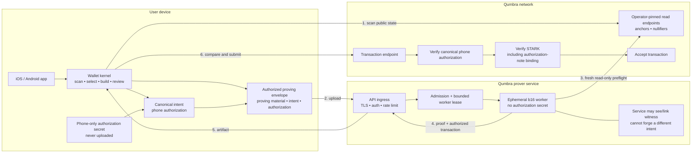
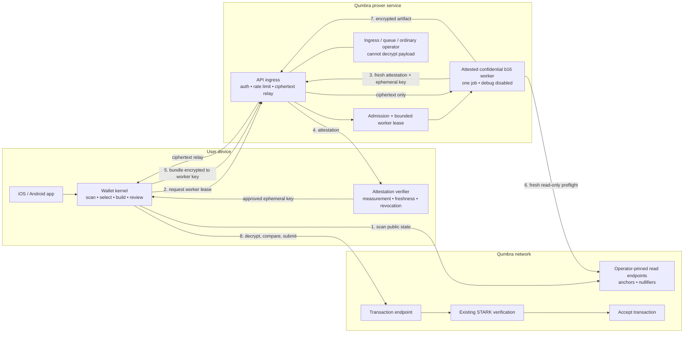

# Remote proving — current decision record

**Status: CURRENT DECISION, NOT IMPLEMENTATION APPROVAL. The product and
security constraints below are decided; the authorization primitive and
confidential-compute route are not. No public prover may carry real value until
one candidate clears the launch gates in §8.**
Paired with
[`remote-proving-decision-zh.md`](remote-proving-decision-zh.md).

Written 2026-08-23 after PR #618, PR #619, and the follow-up security review.
This is the authoritative entry point for remote proving in `qumbra-lab`.
Earlier documents remain the evidence and design record; §10 says how to read
them.

This decision does not silently amend Qumbra's binding design specification.
Selecting protocol-level authorization would require a dated design-repo
correction to the current "one monolithic STARK; no per-spend signatures"
decision before implementation.

---

## 1. Decision in one sentence

Qumbra may pursue one shared logical prover service for all supported phones,
but it must not ship the current trusted `WitnessBundle` handoff for real value:
launch requires either consensus-bound phone-held authorization that no prover
can forge, or a wallet-verified attested confidential worker that the ordinary
operator cannot read. User-operated persistent proving is out of scope.

## 2. What is settled

1. **The product must not require self-hosting.** A user's Mac, home server, or
   rented VM cannot be the standing send path.
2. **Shared proving is computationally feasible.** One public endpoint may
   dispatch to many ephemeral workers; "one service" does not mean one process.
3. **The unchanged protocol is disqualified for real value.** Today's bundle
   gives a worker enough selected-input material to construct, prove, and submit
   a conflicting transaction paying itself.
4. **Phone submission is engineering hygiene, not theft prevention.** It keeps
   submission credentials and typed recovery in the wallet, but a malicious
   worker can submit directly to a public node.
5. **Theft and linkability require independent launch review.** Preventing output
   redirection does not stop a prover or ingress from joining inputs, outputs,
   amount, recipient, nullifiers, device identity, IP, and timing.
6. **The prover needs read-only node access.** It fetches fresh anchors and
   nullifiers from operator-pinned endpoints before allocating proof work. A
   client request never supplies an arbitrary node URL.

Nothing above selects a backend implementation or changes consensus.

## 3. Honest option matrix

| route | every supported phone sends | cannot steal | cannot see/link | T2 consequence | current ruling |
|---|---|---|---|---|---|
| User-operated persistent prover | only if the user operates it | depends on operator | local if honest | none | **rejected by product ruling** |
| b4 local proving, no remote fallback | no; low-memory phones are excluded | yes, locally | yes, locally | re-mint or permanent dual verifier | incomplete for the product target |
| b4 local proving plus remote fallback | yes in principle | fallback still needs authorization or attestation | fallback still sees/links unless confidential | b4 re-mint plus remote-prover cost | no security shortcut over the shared service |
| Trusted shared b16 prover | yes | **fails** | **fails** | none | **rejected for real value**; valueless mechanics experiment only |
| Shared b16 prover plus phone-held authorization | yes | passes only if consensus binds the complete phone-approved intent | **fails** at an ordinary worker | re-mint-class protocol change | **candidate A**; primitive not selected |
| Attested confidential b16 worker | yes in principle | passes only under the attested image/hardware/isolation assumptions | reduces payload visibility; ingress metadata remains | no protocol re-mint in principle | **candidate B**; fit and attestation unmeasured |
| MPC or cryptographically hidden outsourced proving | unknown | intended to pass | may reduce payload visibility | likely extensive | deferred research |

The product comparison is therefore not "b4 versus trust Qumbra." It is b4
plus a protected fallback versus b16 remote proving plus authorization or
attestation.

### Candidate architecture diagrams

The service spine from the baseline topology remains: wallets scan pinned
read endpoints, one public logical service leases ephemeral workers, workers
use pinned read-only node access for preflight, and the wallet normally submits
the returned transaction. The security boundary differs by candidate.

#### Candidate A — consensus-bound phone authorization

The ordinary service may still observe and link the witness. Its security claim
is narrower: the phone keeps the authorization secret, and the node rejects any
transaction whose authorized intent or note binding was changed by the worker.

This route changes consensus. Authorization verification happens before the
expensive STARK verification; the STARK must then prove that the authorization
public values belong to the same hidden inputs.

#### Candidate B — attested confidential worker

This route preserves today's consensus transaction in principle. The wallet
first verifies a fresh worker attestation and binds an ephemeral encryption key
to the approved image/configuration. Only that worker boundary may decrypt the
bundle; ingress, admission, durable infrastructure, and the ordinary operator
must see ciphertext only.

This route changes the transport and trust boundary rather than the transaction
format. The attestation, encryption, hardware, firmware, image-measurement, and
side-channel assumptions are part of its security claim. Ingress metadata
linkability remains.

## 4. The current trusted handoff must not ship

`WitnessBundle` carries each selected input's spend secret and note opening.
There is no separate phone-only authorization in today's transaction. A
modified worker can ignore the approved outputs, construct outputs paying
itself, prove that transaction, and race the wallet's transaction by submitting
directly. Phone-side artifact comparison cannot observe or stop that second
submission.

The blast radius is limited to the selected real inputs; the service does not
receive the wallet seed or openings for unrelated notes. That limit does not
make selected-input theft an acceptable product property.

The detailed data flow, Mermaid architecture, Internet threat surface, queue
and worker boundary, abuse controls, and capacity evidence remain in
[`backend-assisted-proving-security.md`](backend-assisted-proving-security.md).

## 5. Candidate A — required authorization invariant

No signature primitive is selected yet. A protocol-level authorization design
is acceptable only if it preserves all of these invariants:

1. The phone holds an authorization secret that never enters the proving
   bundle. The worker receives only the proving material required by the AIR.
2. The circuit binds the revealed authorization public value to the same hidden
   input note whose membership and nullifier it proves. An API-layer key beside
   the proof is insufficient.
3. One canonical intent covers at least the domain and protocol version,
   network and genesis, anchor, both nullifiers, both output commitments,
   bucket and fee, hashes of discovery and rider bytes, all authorization
   public values, and every future consensus-semantic transaction field.
4. The node recomputes that intent and verifies the phone authorization before
   spending STARK-verification work.
5. Both fixed input slots keep the same public shape. The single-real-input
   dummy path must have an explicit authorization rule and must not reveal the
   real-input count.
6. Transaction ID, body/P2P codecs, mempool identity, replay handling, and the
   activation boundary bind the new fields canonically.

This is a T2 re-mint-class change: note or recipient-key binding, AIR/public
values, transaction wire, node verification, genesis parameters, and migration
all move together.

## 6. Hash-OTS is a research candidate, not the decision

[`hash-ots-spend-authorization.md`](hash-ots-spend-authorization.md) found a
useful structural seam: commit a per-address authorization-key-tree root inside
`rkm`, use one public leaf per spend, prove leaf membership in the STARK, and
verify the signature natively at the node. Because `rkm` has spare Keccak rate,
binding a 256-bit root may require no additional `ROLE_ARKM` permutation.

That insight survives. The concrete WOTS+ construction is **not accepted** as
written:

| severity | blocker | consequence |
|---|---|---|
| P0 | **State rollback and key reuse.** A signature can leave the phone without landing on-chain. A crash, old-backup restore, concurrent device, or withheld/failed job can then reuse the same OTS index. Chain scanning cannot recover signatures that never landed. | Reusing a WOTS+ state removes its forgery guarantee. The wallet threat model does not currently provide rollback-proof, multi-device-safe state. |
| P0 | **The signature instantiation is incomplete.** "Keccak-based WOTS+" does not specify `F`, `PRF`, public `SEED`, `ADRS`, L-tree/public-key compression, exact domain separation, or canonical vectors. RFC 8391 restricts WOTS+ `w` to `{4,16}`; the document's `w=256` option is not that standardized parameter. | The 32-byte public-key claim, verifier, security argument, and wire estimate are not yet protocol specifications. |
| P0 | **The hidden dummy input is unspecified.** Current slot 1 may be an off-tree, prover-invented dummy while the proposed node rule requires two valid signatures and the circuit requires two authorization paths. | The fixed-shape privacy property and acceptance rule are incomplete. |
| P1 | **Costs are estimates.** Address-tree generation/cache, 2^19 peak RSS and time, proof bytes, node verification, and phone signing have not been measured. | The ~163 KB and phone-latency figures cannot decide the route. |
| P1 | **`nk` disclosure remains privacy-sensitive.** Removing `sk` stops prover authorization, but an arbitrary prover still receives full-viewing-class material and the complete selected-spend relationship. | "Any prover cannot steal" would not mean "any prover is private." |

The state risk is not a documentation nicety. RFC 8391 warns that reuse of a
secret-key state removes the security guarantee, and NIST SP 800-208 requires
the next index to be committed to nonvolatile storage before a signature is
exported. See [RFC 8391 §1.1](https://www.rfc-editor.org/rfc/rfc8391.html#section-1.1)
and [NIST SP 800-208](https://csrc.nist.gov/pubs/sp/800/208/final).

### Stateless leaf comparator

The authorization spike must compare WOTS+ with a standardized stateless
signature leaf, initially ML-DSA. One candidate shape commits a Merkle root of
`H(ML-DSA public key)` leaves in `rkm`; the node checks the full public key and
signature outside the STARK, while the circuit still proves only the 32-byte
leaf's membership.

Key reuse in that shape may link repeated use of one leaf, but it does not
destroy signature unforgeability. Using the hash-OTS document's own stated
ML-DSA-44 and WOTS+ sizes, two fixed inputs add about 3,112 bytes relative to
its WOTS+ row. That is paper arithmetic, not a wire claim. Tree-generation
cost, public-key bytes, proof size, node time, mobile time, privacy, and exact
standardized parameters must be measured together.

Other standardized stateless candidates may enter the comparison. No custom
signature construction advances without an independent cryptographic review
and published test vectors.

## 7. Candidate B — attested confidential worker

An attested confidential VM is the only current route that can preserve today's
consensus transaction while preventing the ordinary Qumbra/cloud operator from
reading the witness. It is not ordinary TLS to a VM.

The wallet must verify that an ephemeral encryption key belongs to the approved
worker image and configuration, then encrypt the bundle directly to that key.
The ingress and queue cannot decrypt it. The measurement must pin the prover,
consensus config, protocol version, node allowlist, debug-disabled state, and
result-encryption behavior.

Before selection, the exact SEV-SNP/TDX-class target must demonstrate:

1. current b16 peak private memory, cold/warm proof time, proof bytes, failure
   behavior, and cost for the 12–15 GB-class job;
2. iOS and Android verification of fresh, correct, non-debug, non-revoked
   attestation, with negative cases;
3. encryption across ingress, queue, host, snapshot, swap, crash collection,
   and operator observability;
4. rollback, replay, cancellation, teardown, and regional outage behavior;
5. an explicit hardware, firmware, cloud, side-channel, and availability trust
   statement.

Attestation does not by itself remove linkability. Ingress can still
associate device identity, IP, timing, and the resulting on-chain transaction.

## 8. Real-value launch gates

A public real-value prover is blocked until one candidate passes every
applicable gate:

1. **Cannot steal:** an adversarial prover/operator cannot authorize outputs or
   semantic fields the phone did not approve.
2. **Privacy is explicit:** the design states who can observe/link the witness,
   device, IP, timing, and transaction, with retention and logging rules.
3. **Capacity and availability are measured:** peak memory, time distribution,
   queue policy, cancellation, retry, regional failure, and cost are evidence,
   not estimates.
4. **The Internet boundary is hardened:** authenticate before large allocation;
   measured request/response ceilings; no client URLs; pinned egress; bounded
   jobs; ephemeral workers; no plaintext durable queue, core dump, or witness
   log.
5. **Consensus migration is complete where required:** primitive, AIR, public
   values, wire, verifier, transaction identity, genesis/re-mint, and legacy
   behavior have one activation plan.
6. **Adversarial end-to-end tests pass:** field rewriting, stale/wrong
   attestation, duplicate/replay, dummy shape, disconnect, malicious sizes, and
   worker escape are covered at their real verification seams.

Before those gates, a trusted worker may be used only for a valueless,
explicitly isolated service-mechanics experiment.

## 9. Work order

0. **Independent hardening:** replace both 128 MiB paired-prover protocol
   ceilings with measured bundle/artifact ceilings, derive chunk counts from
   byte limits, and add boundary tests. This does not select an architecture.
1. **Authorization spike:** specify and compare standardized WOTS+, a
   standardized stateless signature leaf, and a random-index WOTS+ leaf end to
   end, including dummy semantics, canonical intent, exact codecs,
   rollback/multi-device behavior, wire bytes, prover RSS/time, node time,
   address creation, restore, and privacy. For the random-index row, treat a
   repeated leaf as catastrophic for acceptance and quantify the ideal-uniform
   birthday bound `q(q−1)/2^(D+1)` per depth-`D` tree, plus multi-wallet and
   multi-target risk, at every depth that fits 2^19. A single random-leaf tree
   is not SLH-DSA and cannot inherit the security argument of
   [FIPS 205](https://csrc.nist.gov/pubs/fips/205/final) without its FORS and
   hypertree construction.
2. **Confidential-worker lane:** run today's b16 circuit on the exact target
   confidential instance and complete the mobile attestation negatives.
3. **Select one launch security basis:** protocol authorization, attested
   confidential work, or both. Do not select from estimated rows.
   *Resolved 2026-08-23 on structural grounds, not estimates:* **A is the
   launch basis; B is a later deployment layer** —
   [`remote-proving-candidate-ruling.md`](remote-proving-candidate-ruling.md).
   Steps 1, 2, 4, 5 still gate implementation; step 2 now runs in parallel.
4. **If authorization wins, correct the binding design spec** before changing
   the lab circuit or wire.
5. **Only then implement and pilot** the public service boundary.

## 10. How to read the earlier records

- [`phone-self-proving-reopened.md`](phone-self-proving-reopened.md) is the
  historical phone-memory/UX handoff and explains why b4 does not cover every
  device by itself.
- [`backend-assisted-proving-security.md`](backend-assisted-proving-security.md)
  is the detailed shared-service feasibility, architecture, threat model, and
  operational-security evidence.
- [`hash-ots-spend-authorization.md`](hash-ots-spend-authorization.md) is a
  concrete research candidate and cost hypothesis. Its structural root-binding
  insight remains useful; its WOTS+ safety claim is not accepted until §6's
  blockers are closed.
- [`m2-iphone-plan.md`](m2-iphone-plan.md) is the underlying phone
  memory/proof-size evidence and build path.

If an earlier document's next-step wording conflicts with this record, this
record is the current lab decision. The binding protocol still lives in the
design repo and changes only through its own correction process.

## 11. Scope at this handoff

- No backend service, cloud resource, account system, authorization primitive,
  attestation path, circuit, wire, genesis, or deployment was built here.
- `CONSENSUS_CFG` remains untouched.
- User-operated persistent proving remains out of scope.
- The current paired-prover remains a trusted-LAN, one-request tool and must not
  be exposed as a real-value public service.
