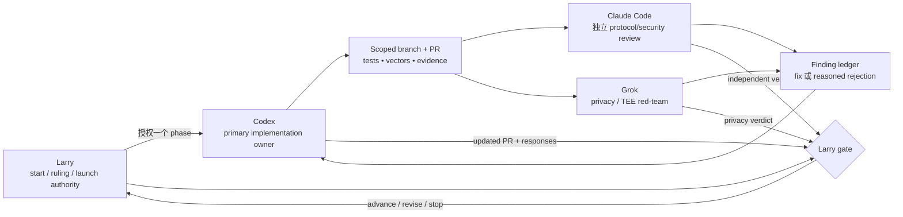

# 远程证明 —— 实现责任与评审计划

**状态：2026-08-24 更新的当前执行分工。不是 implementation approval。本文分配职责与
review gates，不授权修改 circuit、wire、wallet、genesis、cloud 或 deployment。每个
implementation phase 仍需要 Larry 单独、明确地决定开始。**
英文权威版：
[`remote-proving-implementation-plan.md`](remote-proving-implementation-plan.md)。

安全裁定继续以
[`remote-proving-candidate-ruling-zh.md`](remote-proving-candidate-ruling-zh.md) 为准：
所有承载真实价值的 shared prover 都强制采用 Candidate A；Candidate B 是可选
defense-in-depth，不能替代 A 成为资金安全 trust root。

---

## 1. 目的

本 task book 在不修改协议的前提下回答四个执行问题：

1. 谁负责 implementation branch 与 integration result；
2. 谁独立评审 protocol/security properties；
3. 谁 red-team privacy、TEE 与 metadata claims；以及
4. 谁裁决分歧、phase starts 与 launch gates。

这些角色职责对本 workflow 有约束力；具体 model/tool 没有。带日期的更新可以替换
assignee，而不改变 Candidate A/B 裁定或任何 consensus property。

## 2. 当前分工

| 职能 | 当前 assignee | 责任 | 权限边界 |
|---|---|---|---|
| 决策者与 coordinator | **Larry** | 批准 phase start、binding design-spec correction、authorization primitive、T2 re-mint/activation、deployment 与 launch | 唯一最终决策人；模型达成一致不等于批准 |
| Primary implementation owner | **Codex** | 把获准 task book 变成 scoped branches/PRs；实现 code/tests；维护 exact vectors、compatibility evidence、CI 与 handoff | 不得悄悄修改 design spec，也不能自我批准 gate |
| 独立 protocol/security reviewer | **Claude Code** | 攻击 specification 与 immutable PR diff；检查 canonical intent、dummy semantics、domain separation、AIR/public-value binding、wire identity、verifier order、activation 与 migration | 除非 Larry 明确重新分配 ownership，否则不直接修改 primary implementation branch |
| Privacy/TEE red-team | **Grok** | 挑战 A-only/A+B privacy statements；检查 witness visibility、`nk`、ingress identity、IP/timing linkability、attestation、revocation、side channels、retention 与 failure modes | 只对 privacy/deployment risk 提建议；不能替代 protocol review 或批准 launch |

Larry 可以增加其他 human/model reviewers。他们的 findings 进入同一 review ledger；不会
稀释以上四项责任。

## 3. 职责分离

同一时刻只有一个角色拥有一条 branch。独立 reviewer 针对 named commit 或 PR diff 工作。
如果 reviewer 必须实现 fix，应当另开 branch/PR，或者由 Larry 记录带日期的 ownership
transfer；不能在 primary branch 上做无记录混改。

## 4. Phase 计划与 gates

Candidate B measurement 可以在得到自己的明确 start 后并行运行。它不阻塞 Candidate A
research，也不会变成 spend authority。

| Phase | Primary deliverable | Primary owner | Independent gate | Larry decision |
|---|---|---|---|---|
| 0. Start authorization | Named issue/task book、精确 scope、target base 与明确开工许可 | Larry coordinates | 重新阅读 current decision 与 design constraints | Start、narrow 或 defer |
| 1. Authorization spike | ML-DSA stateless-leaf frontrunner，加标准 WOTS+ 与 random-index WOTS+ comparators；dummy rule；canonical intent；codecs/vectors；mobile lifecycle；实测 cost table | Codex | Claude protocol review；Grok 检查暴露材料的 privacy | 选择 primitive/shape，或要求另一次 spike |
| 2. Binding design correction | 带日期的 EN/ZH design-repo correction，允许 consensus-bound phone-held authorization，并定义获准形状 | Codex 按 accepted spike 起草 | Claude 核对 correction 与已评审 invariants 一致 | Larry ratify 或 reject design change |
| 3. Consensus implementation | Note/key binding、AIR/public values、canonical transaction wire/identity、node pre-STARK authorization verification、activation/migration、T2 re-mint fixtures | Codex，拆成可评审 PRs | Claude 评审每个 security-bearing seam 与最终 combined tree | 逐阶段批准；另行批准 re-mint |
| 4. Wallet/mobile integration | Phone-only key hierarchy、review surface、signing、restore/multi-device behavior、iOS/Android FFI 与 negative tests | Codex | Claude 评审 authorization flow；必须有 platform evidence | 批准 supported-device behavior |
| 5A. Shared prover baseline | Candidate A service API、admission、有界 ephemeral b16 workers、operator-pinned read-only node access、wallet return/submission path、abuse controls | Codex | Claude Internet-boundary review；Grok A-only privacy red-team | 允许无价值 pilot；另行批准真实价值 |
| 5B. Confidential-worker lane | 精确 SEV-SNP/TDX 级 fit measurement、end-to-end worker-key binding、mobile attestation negatives、teardown/revocation/failure evidence | Codex，除非另行分配 | Claude isolation/attestation review；Grok privacy/metadata red-team | 决定官方 service 是否/何时叠加 B |
| 6. Combined acceptance | 一份 reconciled evidence pack，覆盖 protocol、wallet、service、privacy claims、capacity、availability、activation 与 rollback | Codex 汇总 | Claude/Grok 分别发布独立 final report | 只有 Larry 能 launch、revise 或 stop |

Phase number 是 workflow 顺序，不是 consensus version。Phase 1 是 research，可以先于 design
correction；Phase 3 的 circuit/wire 工作不可以。

### 4.1 进度账本

`✅` 只表示该项精确、有限范围的 artifact 已实现并留档；不等于批准所属完整 phase、真实价值
service、deployment 或 launch。`⬜` 表示 gate 仍未关闭。

| Scoped artifact | 状态 | Evidence／剩余边界 |
|---|---|---|
| Phase 0 start authorization 与 ownership task book | ✅ | Larry 已明确启动 research，随后又启动 valueless service-mechanics milestone；scope 与 roles 已在本文记录 |
| Phase 1 primitive comparator、exact intent/codecs/vectors、dummy rule 与 shape ruling | ✅ | [`remote-proving-authorization-spike-zh.md`](remote-proving-authorization-spike-zh.md) 与 `qlab-remote-auth`；推进 ML-DSA rotation，不推进 depth 0 与两种 WOTS+ |
| Phase 1 隔离 D12..D16 mobile benchmark harness | ✅ | [`remote-proving-mobile-benchmark-zh.md`](remote-proving-mobile-benchmark-zh.md) 与 `qlab-remote-auth-mobile-bench`；synthetic controls 和 cancel/progress seams 已提交 |
| Phase 1 首轮真机 D12..D16 evidence set | ✅ | [`remote-proving-mobile-evidence-2026-08-24-zh.md`](remote-proving-mobile-evidence-2026-08-24-zh.md)；iPhone 15 Pro Max 与 Solana Mobile Seeker 每档保留两次，跨平台 deterministic output 一致 |
| Phase 1 supported-device floor 与最终全网 depth | ⬜ | 仍需明确 floor hardware/OS、在 floor 上执行同一 two-run protocol、决定 UX threshold，并由 Larry 决定 depth |
| Phase 5A precursor：valueless service mechanics implementation | ✅ | [`remote-proving-service-mvp-zh.md`](remote-proving-service-mvp-zh.md) 与 lab PR #639；真实当前 prover、有界 ephemeral worker、固定 refusal、read-only preflight、无 submit path |
| Phase 5A precursor：standalone deployment skeleton | ✅ | deploy PR #246；loopback-only review skeleton，不是 deployment 或 public edge |
| Phase 2–4 与 Candidate A-bound 真实价值 Phase 5A | ⬜ | Design correction、AIR/public values、wire/node verification、activation 与 wallet/mobile authorization 尚未启动 |
| 独立 Internet-boundary review、capacity evidence 与 valueless pilot approval | ⬜ | 仍需 Claude/Grok review、隔离 host 实测和 Larry 单独 gate |

## 5. Primary owner contract

每个获准 phase 中，Codex 必须：

1. 从当前 `origin/main` 新建 worktree 与一条 scoped branch；
2. 在 broad edits 前记录 governing issue/spec、范围内 files、non-goals、invariants 与
   expected compatibility effects；
3. 让 protocol shape、vectors、implementation、tests 与 docs 保持同步；
4. 把不确定性暴露成 named questions，不得悄悄选择新 protocol rule；
5. 只 stage 该 phase 的文件，默认发布 Draft PR；
6. 如实报告 exact verification commands、CI links、test counts、ignored tests 与每个未跑
   gate；以及
7. ownership/session 变化时，留下指向 commit 的 handoff。

任何 estimate 都不能在没有 measured record 与 Larry decision 时变成 protocol constant。
任何 backend convenience 都不能削弱 Candidate A 的 node-enforced authorization invariant。

## 6. Independent review contract

Claude 评审 named immutable commit 或 PR diff，不评审口头摘要。最低 protocol/security
checklist 是：

- phone-held authorization secret 永不进入 proving bundle；
- canonical complete intent 覆盖所有 consensus-semantic 与 recipient-delivery fields；
- AIR 把每个 authorization public value 绑定到同一个 hidden note、membership path 与
  nullifier；
- hidden dummy slot 保持 fixed public shape，不能成为 unverified authorization bypass；
- node authorization verification 先于昂贵的 STARK verification；
- exact codecs、transaction identity、mempool/replay behavior、legacy refusal、activation
  与 migration 跨层一致；以及
- negative tests 到达真实 verification seams，而不是只测试 helper mocks。

Grok 另行评审 privacy/deployment claims，包括：

- prover、ingress、operator、cloud、logs 与 crash tooling 分别能看见什么；
- A-only 是否明确标成 privacy-degraded；
- A+B encryption 是否只在 verified worker 内终止；
- B 无法隐藏的 device/IP/timing 与 on-chain correlation；
- attestation freshness、revocation、rollback、debug state、side channels 与
  regional/availability failure；以及
- claimed failure 是只降低 privacy/availability，还是能够触及 spend authority。

Reviewer 把 findings 分成 P0/P1/P2 或 advisory，并把每条 finding 链接到 file/line 或
reproducible invariant。Primary owner 必须给出 fix 或 reasoned rejection。剩余分歧由
Larry 裁决。模型沉默、批准或多数票永远不等于 launch decision。

## 7. Verification 与证据纪律

- Agent session **不得在本机运行任何 `cargo test`**，包括 targeted test。编写 tests、
  push branch，并使用 repo CI lane。
- 相关时可以在本地运行 `cargo check` 与 `cargo clippy`。
- Code phases 用 `verify-graviton` on-demand acceptance lane 跑完整 release workspace
  suite。最终记录必须核对 baseline + new tests，并检查 failure/panic/error negatives。
- Measured prover numbers 必须携带 repo revision、prover dependency revisions、hardware、
  OS、power/thermal state；发布前在同一 rig 上复现两次。
- Docs-only ownership update 做 link/parity/diff checks，不触发 heavy acceptance lane。

CI green 是必要证据，不是修改设计或 launch 的授权。

## 8. Handoff 与重新分配

带日期的 reassignment 必须记录：

1. phase 与精确 last accepted commit；
2. open P0/P1/P2 findings 与未解决的 Larry questions；
3. changed files、generated vectors/fixtures 与 compatibility effects；
4. CI/measurement status，包括任何未运行项目；
5. 新 primary owner 或 reviewer；以及
6. old assignee 是否仍足够独立，可以继续 review。

Repo records、commits、vectors 与 CI evidence 是 source of truth；successor 不得依赖另一个
model session 的记忆。新 model version/provider 不会因为继承同一个 role name 而继承批准。

## 9. 当前下一步与范围

**进度更新，2026-08-24：**已完成 component 与 open gate 见 §4.1。Phase 1 已产出 ML-DSA
authorization spike、隔离 D12..D16 mobile harness 与首轮真机 evidence set。D16 在两台
实测设备上均完成，但 supported-device floor 与最终 depth 仍未关闭。
Larry 随后明确启动无价值 shared-service mechanics milestone。
[`remote-proving-service-mvp-zh.md`](remote-proving-service-mvp-zh.md) 是 Phase 5A 的
precursor：它围绕当前真实 prover 实现 bounded admission、read-only preflight 与
ephemeral worker，但没有精确 valueless acknowledgement 就拒绝启动，也没有 submit path。

这不跳过 Phase 2–4。下一个 protocol-bearing action 仍是 binding design correction，之后才是
另行评审的 Candidate A circuit/wire/node 与 wallet 工作。Mechanics service 可以进入 CI、
独立 Internet-boundary review 与无价值 capacity measurement；不得把它解释为真实价值
implementation 或 launch approval。

## 10. 相关记录

- [`remote-proving-decision-zh.md`](remote-proving-decision-zh.md) —— 当前详细 constraints
  与 launch gates。
- [`remote-proving-candidate-ruling-zh.md`](remote-proving-candidate-ruling-zh.md) ——
  Candidate A 强制、Candidate B 可选。
- [`backend-assisted-proving-security-zh.md`](backend-assisted-proving-security-zh.md) ——
  service topology、threat surface 与 operational controls。
- [`hash-ots-spend-authorization-zh.md`](hash-ots-spend-authorization-zh.md) ——
  authorization research seam 与未关闭的 WOTS+ blockers。
- [`remote-proving-a-vs-b-zh.md`](remote-proving-a-vs-b-zh.md) —— Grok 署名、已被取代的
  A/B 判断，保留为 research provenance。
