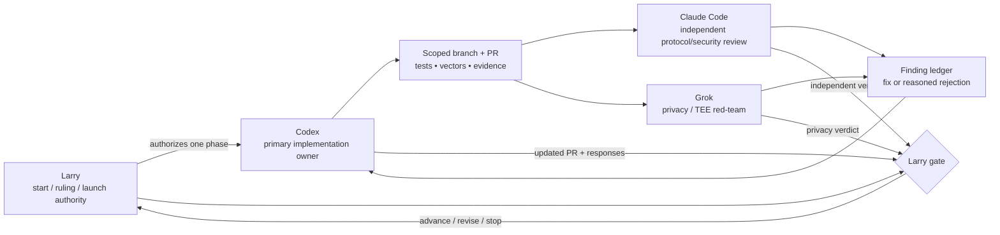

# Remote proving — implementation ownership and review plan

**Status: CURRENT EXECUTION ASSIGNMENT, UPDATED 2026-08-24. NOT IMPLEMENTATION
APPROVAL. This document assigns responsibilities and review gates; it does not
authorize a circuit, wire, wallet, genesis, cloud, or deployment change. Each
implementation phase still requires an explicit Larry start decision.**
Paired with
[`remote-proving-implementation-plan-zh.md`](remote-proving-implementation-plan-zh.md).

The governing security decision remains
[`remote-proving-candidate-ruling.md`](remote-proving-candidate-ruling.md):
Candidate A is mandatory for every real-value shared prover; Candidate B is
optional defense-in-depth and cannot replace A as the funds-safety trust root.

---

## 1. Purpose

This task book answers four execution questions without changing the protocol:

1. who owns the implementation branch and integration result;
2. who reviews protocol/security properties independently;
3. who red-teams privacy, TEE, and metadata claims; and
4. who decides disagreements, phase starts, and launch gates.

The role is normative for this workflow; the named model or tool is not. A
dated update may replace an assignee without changing the Candidate A/B ruling
or any consensus property.

## 2. Current assignment

| function | current assignee | responsibility | authority boundary |
|---|---|---|---|
| Decision authority and coordinator | **Larry** | Approve phase starts, binding design-spec corrections, authorization primitive, T2 re-mint/activation, deployment, and launch | Sole final decision-maker; model agreement is not approval |
| Primary implementation owner | **Codex** | Turn the approved task book into scoped branches/PRs; implement code and tests; maintain exact vectors, compatibility evidence, CI, and handoffs | May not silently amend the design spec or self-approve a gate |
| Independent protocol/security reviewer | **Claude Code** | Attack the specification and immutable PR diff; inspect canonical intent, dummy semantics, domain separation, AIR/public-value binding, wire identity, verifier order, activation, and migration | Does not directly edit the primary implementation branch unless Larry explicitly reassigns ownership |
| Privacy/TEE red-team | **Grok** | Challenge A-only and A+B privacy statements; inspect witness visibility, `nk`, ingress identity, IP/timing linkability, attestation, revocation, side channels, retention, and failure modes | Advises on privacy/deployment risk; cannot replace protocol review or approve launch |

Larry may use additional human or model reviewers. Their findings enter the
same review ledger; they do not dilute the four responsibilities above.

## 3. Separation of duties

One role owns a branch at a time. Independent reviewers work from a named
commit or PR diff. If a reviewer must implement a fix, it happens on a separate
branch/PR or after Larry records a dated ownership transfer; it is not an
unrecorded edit to the primary branch.

## 4. Phase plan and gates

Candidate B measurement may run in parallel after its own explicit start. It
does not block Candidate A research or become authority to spend.

| phase | primary deliverable | primary owner | independent gate | Larry decision |
|---|---|---|---|---|
| 0. Start authorization | Named issue/task book, exact scope, target base, and explicit permission to begin | Larry coordinates | Current decision and design constraints re-read | Start, narrow, or defer |
| 1. Authorization spike | ML-DSA stateless-leaf frontrunner plus standardized WOTS+ and random-index WOTS+ comparators; dummy rule; canonical intent; codecs/vectors; mobile lifecycle; measured cost table | Codex | Claude protocol review; Grok privacy review of exposed material | Select primitive/shape or require another spike |
| 2. Binding design correction | Dated EN/ZH design-repo correction permitting consensus-bound phone-held authorization and defining the approved shape | Codex drafts from the accepted spike | Claude checks that the correction matches the reviewed invariants | Larry ratifies or rejects design change |
| 3. Consensus implementation | Note/key binding, AIR/public values, canonical transaction wire/identity, node pre-STARK authorization verification, activation/migration, T2 re-mint fixtures | Codex, split into reviewable PRs | Claude reviews every security-bearing seam and final combined tree | Approve each stage; separately approve re-mint |
| 4. Wallet/mobile integration | Phone-only key hierarchy, review surface, signing, restore/multi-device behavior, iOS/Android FFI and negative tests | Codex | Claude reviews authorization flow; platform evidence required | Approve supported-device behavior |
| 5A. Shared prover baseline | Candidate A service API, admission, bounded ephemeral b16 workers, operator-pinned read-only node access, wallet-return/submission path, abuse controls | Codex | Claude Internet-boundary review; Grok A-only privacy red-team | Permit valueless pilot; separately permit real value |
| 5B. Confidential-worker lane | Exact SEV-SNP/TDX-class fit measurement, end-to-end worker-key binding, mobile attestation negatives, teardown/revocation/failure evidence | Codex unless reassigned | Claude isolation/attestation review; Grok privacy/metadata red-team | Decide whether/when official service adds B |
| 6. Combined acceptance | One reconciled evidence pack covering protocol, wallet, service, privacy claims, capacity, availability, activation, and rollback | Codex composes | Claude and Grok issue separate final reports | Larry alone launches, revises, or stops |

Phase numbers are workflow ordering, not consensus version numbers. Phase 1 is
research and may precede the design correction; Phase 3 circuit/wire work may
not.

### 4.1 Progress ledger

`✅` means that exact scoped artifact is implemented and recorded; it does not
approve the containing phase, a real-value service, deployment, or launch.
`⬜` remains an open gate.

| scoped artifact | status | evidence / remaining boundary |
|---|---|---|
| Phase 0 start authorization and ownership task book | ✅ | Larry explicitly started the research and later the valueless service-mechanics milestone; scope and roles are recorded here |
| Phase 1 primitive comparator, exact intent/codecs/vectors, dummy rule and shape ruling | ✅ | [`remote-proving-authorization-spike.md`](remote-proving-authorization-spike.md) and `qlab-remote-auth`; ML-DSA rotation advances, depth 0 and both WOTS+ rows do not |
| Phase 1 isolated D12..D16 mobile benchmark harness | ✅ | [`remote-proving-mobile-benchmark.md`](remote-proving-mobile-benchmark.md) and `qlab-remote-auth-mobile-bench`; synthetic controls and cancellation/progress seams are committed |
| Phase 1 physical-device D12..D16 evidence and final network-wide depth | ⬜ | Two retained runs per supported physical device and Larry's depth decision are still owed |
| Phase 5A precursor: valueless service mechanics implementation | ✅ | [`remote-proving-service-mvp.md`](remote-proving-service-mvp.md) and lab PR #639; real current prover, bounded ephemeral workers, fixed refusals, read-only preflight, no submit path |
| Phase 5A precursor: standalone deployment skeleton | ✅ | deploy PR #246; loopback-only review skeleton, not a deployment or public edge |
| Phases 2–4 and Candidate A-bound real-value Phase 5A | ⬜ | Design correction, AIR/public values, wire/node verification, activation and wallet/mobile authorization remain unstarted |
| Independent Internet-boundary review, capacity evidence and valueless pilot approval | ⬜ | Claude/Grok review, isolated-host measurements and a separate Larry gate remain required |

## 5. Primary-owner contract

For each authorized phase, Codex must:

1. start from current `origin/main` in a fresh worktree and one scoped branch;
2. record the governing issue/spec, files in scope, non-goals, invariants, and
   expected compatibility effects before broad edits;
3. keep protocol shape, vectors, implementation, tests, and docs synchronized;
4. expose uncertainties as named questions rather than choosing a new protocol
   rule silently;
5. stage only the phase's files and publish a Draft PR by default;
6. report exact verification commands, CI links, test counts, ignored tests,
   and every unrun gate honestly; and
7. leave a commit-addressed handoff if ownership or session changes.

No estimate becomes a protocol constant without a measured record and Larry's
decision. No backend convenience may weaken Candidate A's node-enforced
authorization invariant.

## 6. Independent-review contract

Claude reviews a named immutable commit or PR diff, not a verbal summary. The
minimum protocol/security checklist is:

- phone-held authorization secret never enters the proving bundle;
- canonical complete intent covers every consensus-semantic and recipient
  delivery field;
- the AIR binds each authorization public value to the same hidden note,
  membership path, and nullifier;
- the hidden dummy slot preserves fixed public shape and cannot become an
  unverified authorization bypass;
- node authorization verification occurs before expensive STARK verification;
- exact codecs, transaction identity, mempool/replay behavior, legacy refusal,
  activation, and migration agree across layers; and
- negative tests reach real verification seams rather than helper-only mocks.

Grok separately reviews privacy/deployment claims, including:

- what the prover, ingress, operator, cloud, logs, and crash tooling can see;
- whether A-only is explicitly described as privacy-degraded;
- whether A+B encryption terminates only inside the verified worker;
- device/IP/timing and on-chain correlation that B does not hide;
- attestation freshness, revocation, rollback, debug state, side channels, and
  regional/availability failure; and
- whether a claimed failure degrades only privacy/availability or can reach
  spend authority.

Reviewers classify findings as P0/P1/P2 or advisory and link each finding to a
file/line or reproducible invariant. The primary owner responds with a fix or a
reasoned rejection. Larry resolves remaining disagreements. A model's silence,
approval, or majority vote is never a launch decision.

## 7. Verification and evidence discipline

- Agent sessions run **no local `cargo test`**, including targeted tests. Write
  tests, push the branch, and use the repository CI lane.
- Local `cargo check` and `cargo clippy` are permitted when relevant.
- Code phases use the `verify-graviton` on-demand acceptance lane for the full
  release workspace suite. The final record reconciles baseline + new tests and
  verifies failure/panic/error negatives.
- Measured prover numbers carry repo revision, prover dependency revisions,
  hardware, OS, power/thermal state, and two reproductions on the same rig
  before publication.
- Docs-only ownership updates require link/parity/diff checks but do not trigger
  the heavy acceptance lane.

CI green is necessary evidence, not authority to change the design or launch.

## 8. Handoff and reassignment

A dated reassignment records:

1. the phase and exact last accepted commit;
2. open P0/P1/P2 findings and unresolved Larry questions;
3. changed files, generated vectors/fixtures, and compatibility effects;
4. CI/measurement status, including anything not run;
5. the new primary owner or reviewer; and
6. whether the old assignee remains independent enough to review.

Repository records, commits, vectors, and CI evidence are the source of truth;
no successor may rely on another model session's memory. A new model version or
provider does not inherit approval merely by taking the same role name.

## 9. Current next action and scope

**Progress update, 2026-08-24:** The completed components and open gates are
tracked in §4.1. Phase 1 produced the ML-DSA authorization spike and isolated
D12..D16 mobile harness, but physical-device evidence and the final depth remain
open. Larry then explicitly started a valueless shared-service mechanics
milestone. The resulting
[`remote-proving-service-mvp.md`](remote-proving-service-mvp.md) is a Phase 5A
precursor: it exercises bounded admission, read-only preflight and ephemeral
workers around today's real prover, but it refuses startup without a valueless
acknowledgement and has no submit path.

This does not skip Phases 2–4. The next protocol-bearing action remains the
binding design correction, followed by the separately reviewed Candidate A
circuit/wire/node and wallet work. The mechanics service may proceed to CI,
independent Internet-boundary review and valueless capacity measurement; it
may not be interpreted as real-value implementation or launch approval.

## 10. Related records

- [`remote-proving-decision.md`](remote-proving-decision.md) — current detailed
  constraints and launch gates.
- [`remote-proving-candidate-ruling.md`](remote-proving-candidate-ruling.md) —
  Candidate A mandatory, Candidate B optional.
- [`backend-assisted-proving-security.md`](backend-assisted-proving-security.md)
  — service topology, threat surface, and operational controls.
- [`hash-ots-spend-authorization.md`](hash-ots-spend-authorization.md) —
  authorization research seam and unresolved WOTS+ blockers.
- [`remote-proving-a-vs-b.md`](remote-proving-a-vs-b.md) — Grok's attributed,
  superseded A/B judgment, retained as research provenance.
