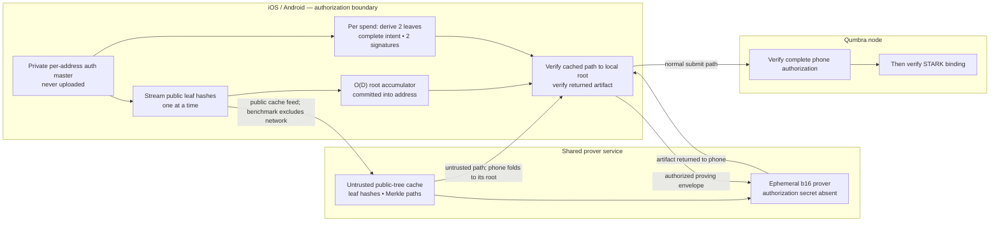

# Remote proving — Candidate A mobile benchmark

**Status: MEASUREMENT HARNESS, 2026-08-24. NOT A PROTOCOL CONSTANT,
PRIMITIVE RE-SELECTION, WALLET INTEGRATION, OR IMPLEMENTATION APPROVAL. No
physical-device result is claimed until clean-revision JSON evidence is
committed.** Tracks [lab issue #630](https://github.com/qumbra-labs/qumbra-lab/issues/630)
and is paired with
[`remote-proving-mobile-benchmark-zh.md`](remote-proving-mobile-benchmark-zh.md).

The governing decision remains
[`remote-proving-candidate-ruling.md`](remote-proving-candidate-ruling.md):
Candidate A is the mandatory real-value security basis and Candidate B is an
optional privacy layer. The Phase 1 result remains
[`remote-proving-authorization-spike.md`](remote-proving-authorization-spike.md):
advance ML-DSA rotation trees, reject depth 0 and both WOTS+ rows, and measure
D12 through D16 before selecting one network-wide depth.

## 1. What the phone actually measures

A shared backend performs the b16 STARK proof. It does not make the phone's
authorization secret safely outsourceable. This harness therefore measures
only the work that must remain on the authorization side of the trust boundary:

1. derive `2^D` ML-DSA-44 leaf keys from a fixed synthetic per-address master;
2. expose only each public leaf and independently compute the address
   `auth_root` with an `O(D)` streaming Merkle frontier;
3. derive the private without-replacement rotation schedule;
4. rederive two selected leaf keys, construct the exact complete two-slot
   intent, sign it twice, and encode the 7,544-byte authorization section; and
5. verify both signatures locally.

It does **not** run a STARK prover, scan a chain, contact a node or service,
open a wallet, derive from a wallet seed, persist a reservation, use Keychain
or Keystore, or serialize a production transaction/proving envelope. All key
material is the public deterministic research fixture. Address initialization
and per-spend timing are reported separately because they have different UX.

## 2. Thin-phone/backend split

The production-shaped split under measurement is:



The service may cache or rebuild public paths so a phone need not retain an
entire tree. A hostile cache can deny service or return a wrong path, but the
phone rejects any path that does not fold to its locally computed root. Giving
the service the private master instead would let it derive leaf signing keys
and defeats Candidate A, so that shortcut is excluded.

## 3. Isolation and ABI

`qlab-remote-auth-mobile-bench` is a separate `staticlib`/`cdylib`/`rlib` that
depends on `qlab-remote-auth`. No shipping `qumbra-*` crate depends on either
research crate. Its hand C ABI:

- accepts only D12 through D16;
- runs synchronously off the UI thread with bounded progress/cancellation;
- writes a fixed 152-byte result only on success;
- returns static status/revision strings, so no allocation crosses the ABI;
- catches Rust unwinding before it can cross C; and
- pins function names and result offsets in written Rust tests.

The iOS shell adds a separate `QumbraAuthBench` target and bundle ID
`dev.qumbra.remote-auth-bench`; the Android shell adds a separate `authbench`
APK with ID `dev.qumbra.remoteauthbench` and no `INTERNET` permission. Neither
target links the production wallet FFI. Existing wallet test targets are never
used for physical-device measurement.

## 4. Evidence schema

Both apps export `qlab-remote-auth-mobile-bench-v1` JSON containing:

- qlab and mobile-shell Git revisions, plus `source_trees_clean`;
- timestamp, platform, hardware identifier, OS, physical memory, low-power
  mode, and start/end thermal state;
- depth, leaf count, ABI version and result-struct size;
- leaf generation, tree hashing, rotation schedule, two-signature/encoding,
  two-verification, and total monotonic nanoseconds;
- process-memory baseline, sampled peak, delta, and metric kind
  (`physical_footprint` on iOS; `pss` on Android);
- exact authorization/key/signature sizes, selected public indices, root, and
  complete-intent digest. The current Fisher-Yates schedule's exact allocation
  (`2^D × 4` bytes) is reported separately; the Merkle frontier itself remains
  `O(D)`.

Accepted evidence requires `source_trees_clean = true`. A local dirty build is
labelled `+dirty`; `unknown` and dirty revisions are useful for development but
not publishable measurements. The root and intent digest for the same depth
must match across every device and platform before timing is interpreted.

The committed D12 control values are:

```text
selected_indices = [3322, 507]
root = c8c3a1582bd6c57ad4b3e878d807e105e48c39e5998ca61ff06fde8ced17a086
intent_digest = 993a54c86ea3725afa30e98cf270fd3686f6c224615939c480a5308826434739
```

CI regenerates these values through the same benchmark path; a mismatch is a
correctness failure, not a performance sample.

## 5. Physical-device protocol

For each device and depth:

1. build the Rust library in `--release` from named clean qlab and shell
   commits; install only the standalone benchmark app;
2. record exact device model/OS, keep low-power mode off, wait for nominal/light
   thermal state, and close unrelated heavy workloads;
3. start at D12, run twice, and retain both raw JSON records rather than only an
   average;
4. advance one depth at a time through D16 only while the app completes, remains
   cancellable, and avoids serious/critical thermal state or OS termination;
5. cool the device before a repeat when thermal state changed; do not silently
   discard a throttled/OOM/cancelled result; and
6. compare deterministic root/digest and static byte counts across iOS and
   Android before comparing latency or memory.

The first evidence set should include the available iPhone 15 Pro Max and at
least one representative supported Android device. A depth does not become a
network constant merely because those devices finish it. Selection also needs
the product's supported-device floor and Larry's explicit gate; a failed or
thermally unstable depth remains evidence to choose a lower depth or revise the
construction, not permission to move the authorization master to the backend.

## 6. Build verification and unrun gates

Permitted local verification for the lab crate:

```console
cargo fmt -p qlab-remote-auth -p qlab-remote-auth-mobile-bench
cargo check -p qlab-remote-auth-mobile-bench --all-targets --locked
cargo clippy -p qlab-remote-auth-mobile-bench --all-targets --locked -- -D warnings
```

Platform shells build their isolated targets with
`scripts/build-auth-bench-ffi.sh` followed by the documented Xcode/Gradle
command. Repository policy forbids agent sessions from running local Rust
tests; the written unit and ABI-pin tests require repository CI. No wallet test
may run on a physical iPhone. No D12..D16 physical-device number is claimed by
the harness implementation itself.

Still out of scope and unresolved: production key hierarchy, crash-safe leaf
reservation, restore, multi-device allocation, public-cache API/authentication,
proving envelope field minimization, AIR/wire/node changes, genesis/re-mint,
and the shared prover deployment.
