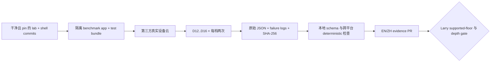

# Remote proving —— 真实设备云测量计划

**状态：暂缓计划，2026-08-24。不是 cloud spend authorization、test run、supported-device
policy、全网 depth 选择或 implementation approval。** Larry 已决定把低端真机测量留到以后。
本文固化安全恢复路径；英文权威版为
[`remote-proving-mobile-device-cloud-plan.md`](remote-proving-mobile-device-cloud-plan.md)。

已完成的首轮证据仍见
[`remote-proving-mobile-evidence-2026-08-24-zh.md`](remote-proving-mobile-evidence-2026-08-24-zh.md)，
benchmark contract 仍见
[`remote-proving-mobile-benchmark-zh.md`](remote-proving-mobile-benchmark-zh.md)。

## 1. 决定与当前边界

目前本地没有可用的低端手机，因此 supported-device-floor 测量暂缓，D12..D16 全网 depth
gate 继续开放。首轮 evidence 不能外推到仅仅满足 shell OS/API minimum（`iOS 17.0` 与
Android API 31）的所有设备；这些是 compatibility 声明，不是 CPU performance floor。

Larry 以后恢复测量时，优先使用托管的**真实物理设备服务**，不用 emulator。如果任何 provider
都没有目标 floor 设备，正确选项是提高首发 product support floor、换 provider，或取得/借用
该实体设备；不得把新设备结果重新标成不存在的旧设备 evidence。

本计划不创建账号、不启用 billing、不预留设备、不上传 app，也不授权 test；每一项都需以后
明确启动。

## 2. Provider 快照，不是永久选型

Provider catalog、价格、retention 与 signing behavior 会变化。执行当天必须重新核对官方页面，
并把 catalog snapshot 与 run 一起提交。截至 2026-08-24：

| Candidate | 当前相关能力 | 执行时必须重查 |
|---|---|---|
| Firebase Test Lab | 托管 iOS physical-device XCTest 与 Android physical-device matrix；console/`gcloud` device catalog；logs 与 raw results 作为 test artifacts 保存 | 精确 model/OS availability 与 capacity、project quota/billing、result-bucket retention |
| AWS Device Farm | 真实 Android/iOS 设备、remote Appium 或 managed automated test、APK/IPA upload、logs/video/artifacts；当前 service 位于 `us-west-2` | 精确 public-device catalog、re-signing 影响、app/log retention、IAM 与 cost |
| BrowserStack App Automate | 通过 Appium、Espresso 或 XCUITest 做真实 Android/iOS automation；上传 APK/IPA 与 test suite；提供 result/log/media API | 精确 model/OS availability、app re-signing、artifact retention、plan limits 与 cost |

初始偏好 Firebase Test Lab，因为一个 service 可执行两端 runner，并返回 machine-readable
artifacts。这不是 vendor lock-in；device availability 与 evidence integrity 优先级更高。

官方能力来源：

- [Firebase Test Lab for iOS](https://firebase.google.com/docs/test-lab/ios/get-started)
- [Firebase iOS device catalog](https://firebase.google.com/docs/test-lab/ios/available-testing-devices)
- [Firebase Android device catalog](https://firebase.google.com/docs/test-lab/android/available-testing-devices)
- [Firebase quota and pricing](https://firebase.google.com/docs/test-lab/usage-quotas-pricing)
- [AWS Device Farm overview](https://docs.aws.amazon.com/devicefarm/latest/developerguide/welcome.html)
- [AWS Device Farm remote access](https://docs.aws.amazon.com/devicefarm/latest/developerguide/remote-access.html)
- [AWS session retention and re-signing](https://docs.aws.amazon.com/devicefarm/latest/developerguide/sessions.html)
- [BrowserStack App Automate API](https://www.browserstack.com/docs/app-automate/api-reference/introduction)

## 3. 隔离 runner 形状

Cloud runner 必须自动化独立 research target，绝不能复用 production-wallet test target。

- iOS：新增只连接 `QumbraAuthBench` 的 benchmark-only XCTest/XCUITest bundle；只链接 research
  benchmark library，不链接 wallet FFI，也绝不接触 wallet Keychain state。
- Android：新增只属于 `authbench` 的 instrumentation runner；链接同一个 benchmark ABI，
  不链接 wallet app，也不接触 Android Keystore state。
- 两端：按顺序执行 D12 到 D16，每档两次；使用与本地 evidence set 相同的 native ABI 与
  deterministic public fixture。
- 每次 run 写一份原样 `qlab-remote-auth-mobile-bench-v1` JSON artifact，并生成 SHA-256
  manifest；不得依赖 clipboard、screenshot、OCR 或手工抄录 timing。
- Cancel、timeout、thermal refusal、OOM、runner crash 或 provider failure 都必须作为
  evidence 保留，不得通过静默重试抹掉。

## 4. Security 与 privacy 规则

只有隔离 benchmark package 可以离开本地环境；其中 key 与 intent 是已经公开的 deterministic
research fixture。

Upload 不得包含：

- production wallet binary、seed、private authorization master 或 user data；
- Keychain/Keystore records、provisioning exports、`.env` 或 backend credentials；
- node/prover credentials、private endpoints 或真实 transaction data；以及
- 无关 source archive 或 repository history。

使用 dedicated cloud project 与 least-privilege test identity。把 IPA signing path、uploaded
binary、logs、screenshots、video 与 result bucket 都视为第三方持有的 artifact。记录 provider
是否 re-sign app，选择可行的最短 retention，本地 hash 验证后删除 provider copy，并在 evidence
pack 中记录删除动作。例如 AWS 明确记录 app re-signing 与不同 app/session-log retention；执行时
必须重查，不能假设长期不变。

Benchmark 不需要 node、prover 或公网访问。不能因为 provider 提供 network connectivity 就削弱
这层隔离。

## 5. Evidence 验收

Upload 前记录：

1. 精确 provider/project 与 region、catalog query time、model/OS identifiers、physical/
   virtual flag 与 device-capacity status；
2. clean lab、mobile-shell 与 test-runner commits；
3. 每个 uploaded APK/IPA/test package 的 SHA-256，以及是否发生 re-signing；
4. 预先声明的 run order、timeout 与 UX acceptance thresholds；
5. artifact bucket/retention 与 deletion owner。

Performance cell 只有在两份保留记录都满足下列条件时才可接受：

- evidence format/ABI 正确且 revision clean；
- 标识预定 physical model 与 OS；
- 起止 thermal 为 nominal、`none` 或 `light`，low-power mode 关闭；
- 无 OOM、timeout、cancel 或 provider infrastructure failure；
- 同一 depth 与其他 platform/device 的 root、complete-intent digest、selected indices 与
  static sizes 全部一致。

Cloud wall-clock job duration、queue time、install time 与 video latency 不是 benchmark timing；
只比较 app 自己的 monotonic native timing。Memory metric kind 仍是 platform-specific，不能
normalize 成虚假的跨平台 ratio。

## 6. 选择 floor 与 depth

在看到新 timing 前，Larry 必须先指定 intended minimum hardware/OS，或者明确接受 catalog 中
最弱的可用设备作为 provisional launch floor。Cold-initialization latency、background/cancel UX、
thermal 与 failure thresholds 也必须先写下；本文不会在看到结果后再发明门槛。

如果任何 provider 都没有 intended floor，除非明确提高 product support floor，否则 floor gate
继续开放。在新设备通过不能作为缺失旧设备的统计估算。

只有 accepted floor evidence 落地后，另一个 dated decision 才能选择 D12..D16。在此之前，
任何 depth 都不是 consensus/address-format constant，protocol-bearing Phase 2 不得悄悄冻结一个。

## 7. 恢复清单

1. Larry 明确恢复 supported-device-floor measurement。
2. 查询当前 physical catalog、price/quota 与 retention，选择 provider 和精确 models。
3. 批准 cloud project、budget ceiling 与 least-privilege identity。
4. 落地并独立 review 隔离 iOS/Android automation runners。
5. 从 clean pinned commits 构建、hash packages，并运行预先声明的 matrix。
6. 取回 artifacts，验证 hashes/schema/deterministic values，然后按记录 policy 删除 provider copies。
7. 提交 raw success/failure 与配对 EN/ZH analysis。
8. Larry 选择 supported floor 与全网 depth，或继续保持 gate open。

当前状态：step 1 明确暂缓；尚未发生任何 cloud action。
