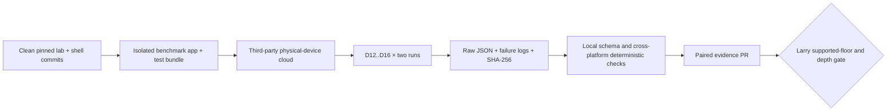

# Remote proving — physical-device cloud measurement plan

**Status: DEFERRED PLAN, 2026-08-24. NOT CLOUD-SPEND AUTHORIZATION, A TEST
RUN, A SUPPORTED-DEVICE POLICY, A NETWORK-WIDE DEPTH SELECTION, OR
IMPLEMENTATION APPROVAL.** Larry deferred lower-bound physical-device testing
until a later date. This record preserves the safe resumption path and is
paired with
[`remote-proving-mobile-device-cloud-plan-zh.md`](remote-proving-mobile-device-cloud-plan-zh.md).

The completed first evidence set remains
[`remote-proving-mobile-evidence-2026-08-24.md`](remote-proving-mobile-evidence-2026-08-24.md).
The benchmark contract remains
[`remote-proving-mobile-benchmark.md`](remote-proving-mobile-benchmark.md).

## 1. Decision and current boundary

No lower-bound phone is currently available locally. The supported-device-floor
measurement is therefore deferred, and the D12..D16 network-depth gate remains
open. No result in the first evidence set may be extrapolated to every device
that merely satisfies the shells' OS/API minimums (`iOS 17.0` and Android API
31). Those are compatibility declarations, not CPU-performance floors.

When Larry resumes this measurement, the preferred route is a **hosted real,
physical-device service**, not an emulator. If no provider offers the intended
floor device, the choices are to raise the initial product support floor, use a
different provider, or acquire/borrow that device. A newer-device result must
not be relabelled as evidence for an unavailable older device.

This plan does not create an account, enable billing, reserve devices, upload an
app, or authorize a test. Each is a later explicit action.

## 2. Provider snapshot, not a permanent selection

Provider catalogs, prices, retention and signing behavior change. Re-check the
official pages on the execution date and commit a catalog snapshot with the
run. As of 2026-08-24:

| candidate | relevant current capability | execution-time check |
|---|---|---|
| Firebase Test Lab | Hosted iOS physical-device XCTest and Android physical-device matrices; console/`gcloud` device catalogs; logs and raw results stored as test artifacts | Exact model/OS availability and capacity, project quota/billing, result-bucket retention |
| AWS Device Farm | Real Android/iOS devices, remote Appium or managed automated tests, uploaded APK/IPA, logs/video/artifacts; service currently in `us-west-2` | Exact public-device catalog, re-signing effect, app/log retention, IAM and cost |
| BrowserStack App Automate | Real Android/iOS automation through Appium, Espresso or XCUITest; APK/IPA and test-suite upload; result/log/media APIs | Exact model/OS availability, app re-signing, artifact retention, plan limits and cost |

Initial preference is Firebase Test Lab because one service can execute both
platform runners and return machine-readable artifacts. That preference is not
vendor lock-in and does not outrank device availability or evidence integrity.

Official capability references:

- [Firebase Test Lab for iOS](https://firebase.google.com/docs/test-lab/ios/get-started)
- [Firebase iOS device catalog](https://firebase.google.com/docs/test-lab/ios/available-testing-devices)
- [Firebase Android device catalog](https://firebase.google.com/docs/test-lab/android/available-testing-devices)
- [Firebase quota and pricing](https://firebase.google.com/docs/test-lab/usage-quotas-pricing)
- [AWS Device Farm overview](https://docs.aws.amazon.com/devicefarm/latest/developerguide/welcome.html)
- [AWS Device Farm remote access](https://docs.aws.amazon.com/devicefarm/latest/developerguide/remote-access.html)
- [AWS session retention and re-signing](https://docs.aws.amazon.com/devicefarm/latest/developerguide/sessions.html)
- [BrowserStack App Automate API](https://www.browserstack.com/docs/app-automate/api-reference/introduction)

## 3. Isolated runner shape

The cloud runner must automate the standalone research targets; it must never
reuse a production-wallet test target.

- iOS: add a benchmark-only XCTest/XCUITest bundle attached solely to
  `QumbraAuthBench`. It links the research benchmark library, not the wallet
  FFI, and never touches wallet Keychain state.
- Android: add an `authbench`-only instrumentation runner. It links the same
  benchmark ABI, not the wallet app, and never touches Android Keystore state.
- Both: run D12 through D16 in order, twice per depth, using the same native ABI
  and deterministic public fixture as the local evidence set.
- Write one unmodified `qlab-remote-auth-mobile-bench-v1` JSON artifact per run
  plus a SHA-256 manifest. Do not depend on clipboard, screenshots, OCR, or
  manually transcribed timing.
- A cancel, timeout, thermal refusal, OOM, runner crash or provider failure is
  retained as evidence. It is never silently retried away.

## 4. Security and privacy rules

Only the isolated benchmark packages may leave the local environment. Their
keys and intent are the already-public deterministic research fixture.

The upload must contain none of the following:

- production wallet binary, seed, private authorization master or user data;
- Keychain/Keystore records, provisioning exports, `.env` files or backend
  credentials;
- node/prover credentials, private endpoints or real transaction data; or
- unrelated source archives or repository history.

Use a dedicated cloud project and least-privilege test identity. Treat the IPA
signing path, uploaded binaries, logs, screenshots, video and result bucket as
third-party-held artifacts. Record whether the provider re-signs the app,
choose the shortest workable retention, delete provider copies after local
hash verification, and record that deletion in the evidence pack. AWS, for
example, documents app re-signing and separate app/session-log retention; these
facts must be rechecked rather than assumed stable.

The benchmark requires no node, prover or public network access. Do not weaken
that isolation merely because the provider offers network connectivity.

## 5. Evidence acceptance

Before uploading, record:

1. exact provider/project and region, catalog query time, model/OS identifiers,
   physical-versus-virtual flag and device-capacity status;
2. clean lab, mobile-shell and test-runner commits;
3. SHA-256 of every uploaded APK/IPA/test package and whether re-signing occurs;
4. predeclared run order, timeout and UX acceptance thresholds; and
5. artifact bucket/retention and deletion owner.

A performance cell is acceptable only when both retained records:

- report the expected evidence format/ABI and clean revisions;
- identify the intended physical model and OS;
- start/end at nominal, `none` or `light` thermal state with low-power mode off;
- complete without OOM, timeout, cancellation or provider infrastructure
  failure; and
- match every other platform/device record for root, complete-intent digest,
  selected indices and static sizes at that depth.

Cloud wall-clock job duration, queue time, install time and video latency are
not benchmark timing. Only the app's monotonic native timings are compared.
Memory metric kinds remain platform-specific and must not be normalized into a
false cross-platform ratio.

## 6. Selecting the floor and depth

Before seeing new timing, Larry must either name the intended minimum hardware
and OS or explicitly accept the weakest available catalog device as a
provisional launch floor. The cold-initialization latency, background/cancel UX,
thermal and failure thresholds must also be written before the run; this plan
does not invent them after observing results.

If the intended floor is absent from every provider, the floor gate stays open
unless product support is explicitly raised. Passing on a newer phone is not a
statistical estimate of the missing phone.

Only after the accepted floor evidence lands may a separate dated decision
select D12..D16. Until then, no depth is a consensus or address-format constant,
and protocol-bearing Phase 2 work must not silently freeze one.

## 7. Resume checklist

1. Larry explicitly resumes the supported-device-floor measurement.
2. Query current physical catalogs, price/quota and retention; select provider
   and exact models.
3. Approve the cloud project, budget ceiling and least-privilege identity.
4. Land and independently review the isolated iOS/Android automation runners.
5. Build from clean pinned commits; hash packages; run the predeclared matrix.
6. Retrieve artifacts, verify hashes/schema/deterministic values, then delete
   provider copies according to the recorded policy.
7. Commit raw successes and failures with paired EN/ZH analysis.
8. Larry selects the supported floor and network-wide depth, or keeps the gate
   open.

Current state: step 1 is deliberately deferred. No cloud action has occurred.
