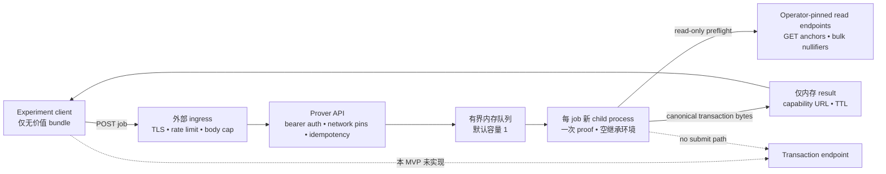

# Remote proving service —— 无价值 mechanics MVP

**状态：MECHANICS EXPERIMENT 已实现，2026-08-24。仅限无价值环境。不是 public/
real-value prover，不是 Candidate A integration，也不是 deployment approval。**
英文权威版本：[`remote-proving-service-mvp.md`](remote-proving-service-mvp.md)。

约束仍来自 [`remote-proving-decision-zh.md`](remote-proving-decision-zh.md) 与
[`remote-proving-candidate-ruling-zh.md`](remote-proving-candidate-ruling-zh.md)：真实价值必须
有 Candidate A。当前 `WitnessBundle` 仍携带已选 input 的 spend authority，当前 AIR/wire/node
也没有绑定手机 authorization。因此 operator 不作出明确「仅限无价值」确认时，服务拒绝启动。

## 1. 这一阶段实现什么

`qumbra-prover-service` 围绕现有真实 b16 prover 实现 service mechanics，但不虚构尚未存在
的协议安全属性：

- upload body 读取前完成 bearer authentication；
- bearer token 通过已审计的 `subtle` constant-time primitive 比较；
- protocol、mode、genesis 与 consensus label 精确 pin；
- decoded bundle 64 KiB、JSON request 96 KiB 的上限；
- mandatory idempotency key 与不可猜测的 256-bit job capability；
- 单 dispatcher、有界 memory queue、取消与 proof timeout；
- 每个 proof 一个新 child process，且不继承 parent environment；
- 只使用 operator-pinned endpoint 做 anchor/nullifier read-only preflight，anchor 与全部
  nullifier response 共享一个 fail-closed byte budget；
- artifact 上限 256 KiB，与 node transaction admission cap 一致；
- 结果只短期保留在内存，response 一律 `Cache-Control: no-store`；
- worker scope 结束时同时 zeroize raw 与 decoded witness material；以及
- artifact 只返回 caller，没有 transaction submission route。

Worker 调用现有的 `WitnessBundle::from_bytes`、有界的
`spend::preflight_urls_limited` wrapper 与 `spend::prove`，从不调用 `spend::submit`。可能泄露
anchor、nullifier、internal endpoint
或 bundle fact 的错误详情全部收敛为固定 code allowlist。

## 2. 架构与信任边界

TLS 与公开 abuse control 位于 binary 外部。Binary 默认只监听 `127.0.0.1:8087`；监听非
loopback 地址需要第二条精确 operator acknowledgement。Container topology 必须把 API 放在
private network，并只通过 ingress 暴露。

普通 worker 能看见并关联完整 witness。Process isolation、no logs 与 short retention 只能
降低意外暴露，不能提供 witness confidentiality；Candidate B 仍是独立、可选的 confidential
worker lane。

## 3. HTTP contract

所有 `/v1/jobs` route 都要求唯一 `Authorization: Bearer …` header。`POST` 还要求唯一
`Content-Type: application/json` 与 16–64 字节 restricted ASCII `Idempotency-Key`。
Unknown JSON field 会被拒绝。

Request 固定为 protocol v1、`valueless-current-witness-v1` mode、精确 valueless ack、
operator-pinned genesis/config 以及 unpadded base64url `WitnessBundle`。新 job 返回 `202` 与
`Location`。同 idempotency key + byte-identical request 返回同 job；同 key 换 payload 返回
`409 idempotency-key-reused`。

- `GET /v1/jobs/<job_id>`：`queued`、`running`、`succeeded`、`refused` 或 `cancelled`；
- success 返回 canonical transaction bytes、byte length 与 Keccak-256 digest；
- `DELETE /v1/jobs/<job_id>` 取消 queued job 或杀掉 running child；
- `GET /healthz` 无需 auth，是纯 liveness probe，完整 JSON body 为
  `{"alive":true}`；它不声称 worker ready，也不暴露 mode、build、queue、job 或 witness fact。

本版本刻意没有 submit endpoint、client-selected URL、可创建第二 proof lease 的 retry、access
log、account database 或 durable queue。

## 4. Fail-closed configuration

启动必须提供：

- `QUMBRA_PROVER_VALUELESS_EXPERIMENT=I_UNDERSTAND_THIS_CANNOT_CARRY_REAL_VALUE`；
- 32–256 字节 API token，优先从 `QUMBRA_PROVER_API_TOKEN_FILE` 读取；
- operator-pinned `QUMBRA_PROVER_SCAN_URL` 与 `QUMBRA_PROVER_NODE_URL`；
- exact genesis format、64 lowercase hex genesis hash 与 restricted consensus label；
- `QUMBRA_PROVER_MAX_UPSTREAM_BYTES` 是 pinned anchor/nullifier preflight 共享的 decoded-body
  总预算；每次 request 在 decode 前还会用当时的剩余预算限制 whole response。默认
  8 MiB，范围 64 KiB–64 MiB。

Queue capacity 默认 1、范围 1..=8；result TTL 默认 600 s、范围 60..=3600；prove timeout
默认 300 s、范围 30..=1800。Insecure node HTTP 与 non-loopback listener 各自需要独立的长
acknowledgement，client request 无法放宽这些选择。

Genesis/config 字段只固定 caller 与 operator configuration 之间的一致；当前 anchor 与
nullifier HTTP surface 不会自行证明 genesis hash，所以它们不是 upstream network identity 的
cryptographic proof。Production design 必须关闭 endpoint authentication 缺口，不能把这些
request 字段当作充分保护。

`deploy/docker/Dockerfile` 提供独立 `runtime-prover-service` target。它只安装 prover 作为
application binary，并以 UID 10001 运行；minimal Debian base 仍包含操作系统工具，不能宣称为
distroless 或 no-shell sandbox。Image 不携带 wallet directory、node state、cloud credential 或
submission key。实际部署仍必须补齐 read-only filesystem、drop capabilities、
`no-new-privileges`、PID/memory/CPU limits、禁止 core dump、private node-read network 与
digest-pinned image。

## 5. 已实现 invariant 与仍未关闭的 gate

当前 invariant：auth 后才读 body；拒绝 request-selected endpoint 与 network/config mismatch；
plaintext payload 不进入 durable queue/job record；一个 service process 最多同时启动一个
prover child；worker 接收 witness 前清空 inherited environment；取消/超时会杀 child 并丢弃
输出；只返回固定 refusal code；没有 transaction submission code path。

这些性质**不会**让当前 bundle 适合真实价值。仍缺 binding design correction、Candidate A key
lifecycle、AIR/public-value binding、transaction wire/identity、node pre-STARK authorization、
activation/re-mint、wallet complete-intent comparison、per-install asymmetric authentication、
production ingress privacy、capacity evidence、worker filesystem/credential isolation 与 egress
enforcement、multi-region availability 以及独立
Internet-boundary review。尤其是，`env_clear` 只能阻止意外继承环境变量，并不是 sandbox；在
隔离补齐前，同 UID 的 compromised worker 仍可能尝试读取 mounted API-token file。Typed
value zeroization 只是 defense in depth，不能证明 compiler、allocator、kernel swap 或 core dump
从未保留其他副本；swap 与 core dump 仍必须在隔离后的 worker boundary 关闭。

真正的 authorized proving envelope 替换当前 bundle 时必须升级 API version；不得原地扩展 v1，
让旧 client 看起来像已经得到 Candidate A 保护。

## 6. Verification 与未跑 gate

允许本地运行 `cargo fmt`、`cargo check`、`cargo clippy` 与 `git diff --check`。Repo policy
禁止 agent 本地运行任何 `cargo test`。已写 tests pin auth、network/ack refusal、idempotency、
capability shape、byte ceilings 与 error-detail suppression，必须由 Graviton CI 执行。

本实现 PR 不运行或授权真实 proof、public listener、cloud resource、live node、wallet 或任何
transaction submission。
