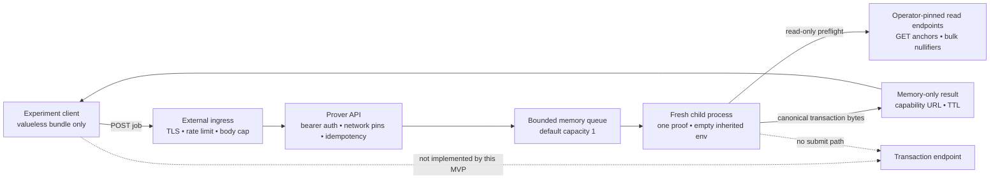

# Remote proving service — valueless mechanics MVP

**Status: IMPLEMENTED MECHANICS EXPERIMENT, 2026-08-24. VALUELESS ONLY. NOT A
PUBLIC OR REAL-VALUE PROVER, NOT CANDIDATE A INTEGRATION, AND NOT DEPLOYMENT
APPROVAL.** Paired with
[`remote-proving-service-mvp-zh.md`](remote-proving-service-mvp-zh.md).

The governing decisions remain
[`remote-proving-decision.md`](remote-proving-decision.md) and
[`remote-proving-candidate-ruling.md`](remote-proving-candidate-ruling.md).
Candidate A is mandatory for real value. Today's `WitnessBundle` still carries
selected-input spend authority, and today's AIR/wire/node do not bind a phone
authorization. This service therefore refuses to start unless the operator
acknowledges that it is a valueless experiment.

## 1. What this milestone proves

`qumbra-prover-service` exercises the service mechanics around the existing real
b16 prover without claiming the missing protocol property:

- authenticated HTTP admission before an upload body is read;
- exact protocol, mode, genesis and consensus-label pins;
- a 64 KiB decoded-bundle ceiling and 96 KiB request ceiling;
- required idempotency keys and unguessable 256-bit job capabilities;
- one dispatcher, a bounded in-memory queue, cancellation and proof timeout;
- one fresh child process per proof, with an empty inherited environment;
- operator-pinned read-only anchor/nullifier preflight;
- a 256 KiB artifact ceiling matching the node's transaction admission cap;
- short-lived in-memory results, removed by an independent TTL sweeper, with
  `Cache-Control: no-store`; and
- proof artifact return to the caller, with no transaction-submission route.

The worker invokes the existing `WitnessBundle::from_bytes`,
`spend::preflight_urls`, and `spend::prove` seams. It never calls
`spend::submit`. Refusal details that could expose an anchor, nullifier, endpoint
or bundle fact are collapsed to a fixed error-code allowlist.

## 2. Architecture and trust boundary



TLS and public abuse controls are intentionally external to the binary. The
binary defaults to `127.0.0.1:8087`; a non-loopback bind needs a second exact
operator acknowledgement. The container topology must keep the API on a
private network behind its ingress.

The ordinary worker can see and link the complete witness. Process isolation,
no logs and short retention reduce accidental exposure; they do not provide
witness confidentiality. Candidate B remains a separate optional confidential
worker lane.

## 3. HTTP contract

All `/v1/jobs` routes require one `Authorization: Bearer …` header. `POST`
also requires exactly one `Content-Type: application/json` and one
`Idempotency-Key` of 16–64 restricted ASCII characters. Unknown JSON fields are
refused.

```http
POST /v1/jobs HTTP/1.1
Authorization: Bearer <experiment token>
Idempotency-Key: <per-attempt random value>
Content-Type: application/json

{
  "protocol_version": 1,
  "mode": "valueless-current-witness-v1",
  "experiment_ack": "VALUELESS_ONLY_CURRENT_WITNESS_BUNDLE_IS_SPEND_AUTHORITY",
  "genesis_format": 5,
  "genesis_hash": "<64 lowercase hex characters>",
  "consensus_label": "<operator pin>",
  "bundle_b64": "<unpadded base64url WitnessBundle>"
}
```

A new job answers `202` plus `Location: /v1/jobs/<job_id>`. Reusing the same
idempotency key and byte-identical request returns the same job; reusing it for
a changed request answers `409 idempotency-key-reused`.

- `GET /v1/jobs/<job_id>` returns `queued`, `running`, `succeeded`, `refused`,
  or `cancelled`.
- A successful result includes canonical transaction bytes as unpadded
  base64url, their byte length and Keccak-256 digest.
- `DELETE /v1/jobs/<job_id>` cancels queued work or kills the running child.
- `GET /healthz` is unauthenticated and exposes only mode, build revision and
  aggregate queue counts. It carries no job identifier or witness fact.

There is deliberately no submit endpoint, arbitrary URL field, retry that
creates a second proof lease, access log, account database or durable queue.

## 4. Fail-closed configuration

The binary requires:

| variable | rule |
|---|---|
| `QUMBRA_PROVER_VALUELESS_EXPERIMENT` | exact `I_UNDERSTAND_THIS_CANNOT_CARRY_REAL_VALUE` |
| `QUMBRA_PROVER_API_TOKEN_FILE` | preferred token source, 32–256 bytes; direct env token is development-only |
| `QUMBRA_PROVER_SCAN_URL` | operator-pinned HTTPS base used only for bulk nullifiers |
| `QUMBRA_PROVER_NODE_URL` | operator-pinned HTTPS base used only for anchors |
| `QUMBRA_PROVER_GENESIS_FORMAT` | exact request pin |
| `QUMBRA_PROVER_GENESIS_HASH` | exactly 64 lowercase hex characters |
| `QUMBRA_PROVER_CONSENSUS_LABEL` | 1–64 restricted ASCII characters |

Optional bounds are queue capacity `1..=8` (default 1), result TTL 60–3600 s
(default 600), and proof timeout 30–1800 s (default 300). Insecure HTTP and a
non-loopback listener each require their own long exact acknowledgement. Client
requests can never relax either choice.

The genesis/config fields pin agreement between the caller and operator
configuration; the current anchor and nullifier HTTP surfaces do not attest
their own genesis hash. They are therefore not cryptographic proof of upstream
network identity. A production design must close that endpoint-authentication
gap instead of treating these request fields as sufficient.

The service build has a dedicated Docker target:

```console
docker build -f deploy/docker/Dockerfile --target runtime-prover-service \
  --build-arg GIT_REVISION=$(git rev-parse HEAD) \
  -t qumbra-prover-service:<revision> .
```

The runtime image installs only the prover as an application binary and runs it
as UID 10001. Its minimal Debian base still contains operating-system tools; it
is not a distroless or no-shell sandbox. The image carries no wallet directory,
node state, cloud credential or submission key. Runtime deployment still owes a
read-only filesystem, dropped capabilities,
`no-new-privileges`, PID/memory/CPU limits, core-dump disablement, a private
node-read network and a digest-pinned image.

## 5. Security invariants and known gaps

The implemented invariants are:

1. authenticate and claim a bounded handler before reading an upload;
2. refuse request-selected endpoints and network/config mismatches;
3. never retain plaintext payloads in a durable queue or job record;
4. start at most one prover child at a time per service process;
5. clear inherited environment before a worker receives witness bytes;
6. kill the child on cancellation or timeout and discard its output;
7. return only fixed refusal codes, never witness/error detail; and
8. expose no transaction-submission code path.

They do **not** make the current bundle safe for real value. Missing launch
work still includes the binding design correction, Candidate A key lifecycle,
AIR/public-value binding, transaction wire/identity, node pre-STARK
authorization verification, activation/re-mint, wallet complete-intent checks,
per-install asymmetric authentication, production ingress privacy,
upstream-response ceilings, capacity evidence, worker filesystem/credential
isolation and egress enforcement, multi-region availability and an independent
Internet-boundary review. In particular, `env_clear` prevents accidental
environment inheritance but is not a sandbox: until that isolation exists, a
compromised worker running under the same UID could attempt to read the mounted
API-token file.

The API version must change when an actual authorized proving envelope replaces
the current bundle. It must not be extended in place in a way that makes a v1
client appear protected by Candidate A.

## 6. Verification and unrun gates

Permitted local checks:

```console
cargo fmt -p qumbra-prover-service
cargo check -p qumbra-prover-service --all-targets --locked
cargo clippy -p qumbra-prover-service --all-targets --locked -- -D warnings
git diff --check
```

Repository policy forbids agent sessions from running local `cargo test`.
Written tests pin authorization, network/ack refusal, idempotency, capability
shape, byte ceilings and error-detail suppression; they require Graviton CI.
No real proof, public listener, cloud resource, live node, wallet or transaction
submission is exercised or authorized by this implementation PR.
